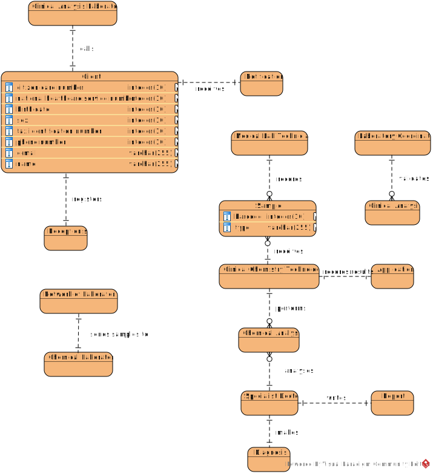

# OO Analysis #

The construction process of the domain model is based on the client specifications, especially the nouns (for _concepts_) and verbs (for _relations_) used. 

## Rationale to identify domain conceptual classes ##
To identify domain conceptual classes, start by making a list of candidate conceptual classes inspired by the list of categories suggested in the book "Applying UML and Patterns: An Introduction to Object-Oriented Analysis and Design and Iterative Development". 

### _Conceptual Class Category List_ ###

**Business Transactions**

*

---

**Transaction Line Items**

Sample

---

**Product/Service related to a Transaction or Transaction Line Item**

Parameter

---

**Transaction Records**

Test

---  

**Roles of People or Organizations**

Receptionist, Client, Medical Lab Technician, Specialist Doctor, Laboratory Coordinator, 
Clinical Chemistry Technologist, Client, Administrator, Courier

---

**Places**

Clinical Analysis Laboratory
Chemical Laboratory

---

**Noteworthy Events**

Clinical Analysis Laboratories Call The Client To Collect The Samples, Receptionist Registers The Client,
Samples Are Sent To The Chemical Laboratory, Medical Lab Technician Records The Samples,
Medical Lab Technician Identifies Each Sample With A Barcode, Clinical Chemistry Technologist Receives The Samples,
Clinical Chemistry Technologist Performs The Chemical Analysis,
Clinical Chemistry Technologist Records The Results In The Software Application,
Specialist Doctor Analyses Chemical Analyses, Makes A Diagnosis And Writes A Report,
Laboratory Coordinator Validates The Results Of The Clinical Analyses,
The Client Receives A Notification

---

**Physical Objects**

Sample

---

**Descriptions of Things**

Category, Type Of Test, Testing, Chemical Analysis

---

**Catalogs**

*  

---

**Containers**

Application, Client Data

---

**Elements of Containers**

Citizen Card Number, National Healthcare Service (NHS) Number, Birth Date, Sex, Tax Identification Number (TIF), 
Phone Number, E-mail, Name, Test Results

---

**Organizations**

Company

---

**Other External/Collaborating Systems**

External API

---

**Records of finance, work, contracts, legal matters**

* 

---

**Financial Instruments**

*  

---

**Documents mentioned/used to perform some work/**

National Healthcare Service (NHS), Citizen Card Number, Tax Identification Number (TIF)

---

###**Rationale to identify associations between conceptual classes**###

An association is a relationship between instances of objects that indicates a relevant connection and that is worth of remembering, or it is derivable from the List of Common Associations: 

+ **_A_** is physically or logically part of **_B_**
+ **_A_** is physically or logically contained in/on **_B_**
+ **_A_** is a description for **_B_**
+ **_A_** known/logged/recorded/reported/captured in **_B_**
+ **_A_** uses or manages or owns **_B_**
+ **_A_** is related with a transaction (item) of **_B_**
+ etc.

| Concept (A) 		|  Association   	|  Concept (B) |
|----------	   		|:-------------:		|------:       |
| Clinical Analysis Laboratories | Calls |  The Client To Collect The Samples |
| Receptionist  	| Registers | The Client  |
| Network of Laboratories | Send | Samples To The Chemical Laboratory |
| Medical Lab Technician  | Records |  The Samples |
|   |  Identifies   | Each Sample With A Barcode  |
|  Clinical Chemistry Technologist  |       Receives         |   The Samples        |
|    | Performs    |  The Chemical Analysis  |
|    |   Records  |   The Results In The Software Application  |
|   Specialist Doctor   | Analyses    |    Chemical Analyses   |
|   | Makes  | A Diagnosis And Writes A Report  |
| Laboratory Coordinator  | Validates  | The Results Of The Clinical Analyses |
|The Client |Receives | A Notification |

## Domain Model

**Do NOT forget to identify concepts atributes too.**

**Insert below the Domain Model Diagram in a SVG format**

