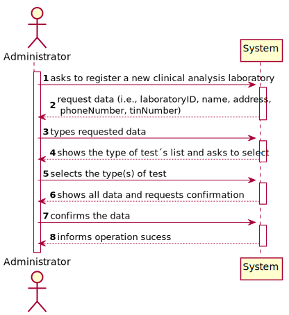
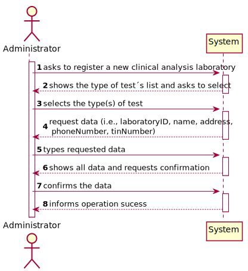
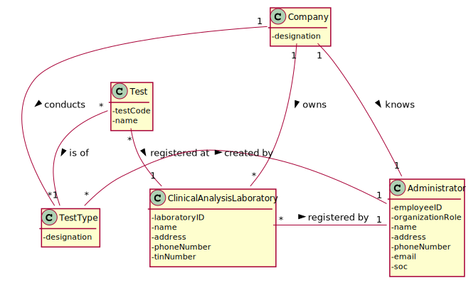
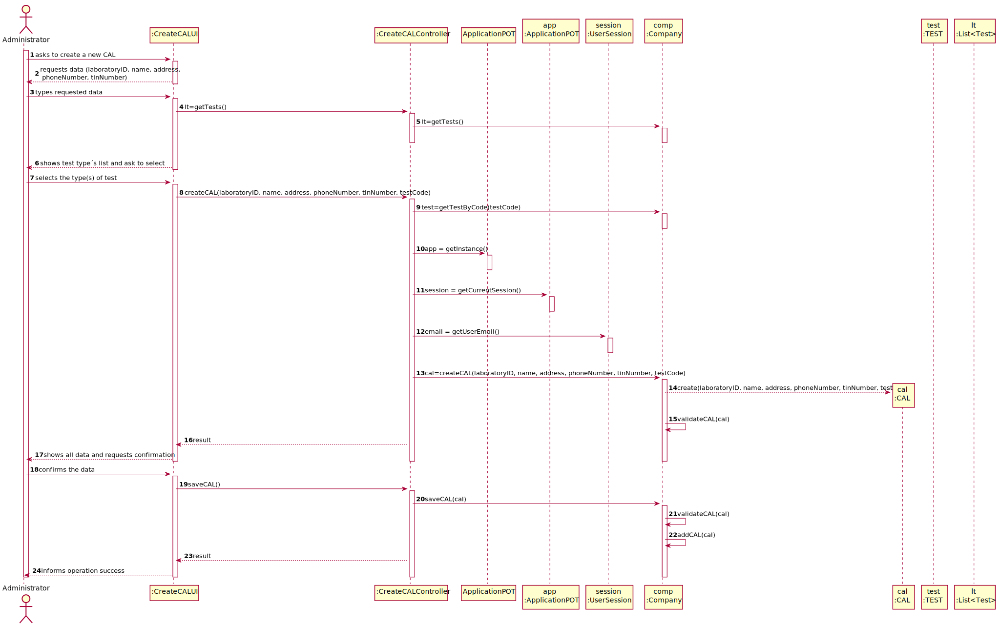
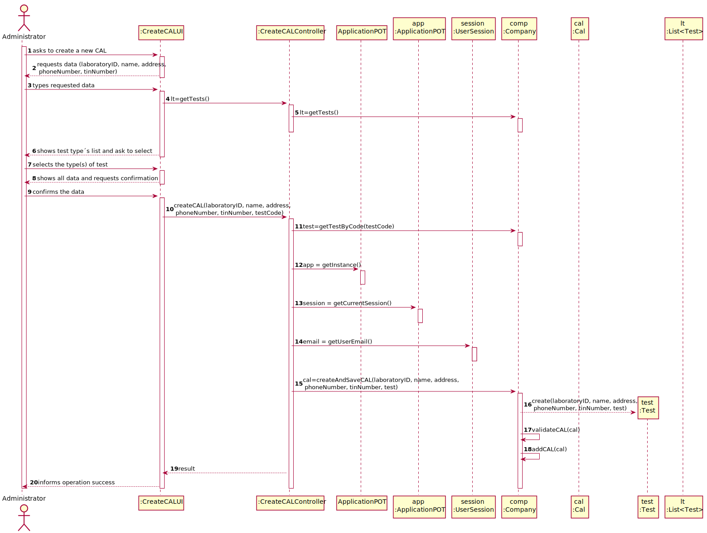
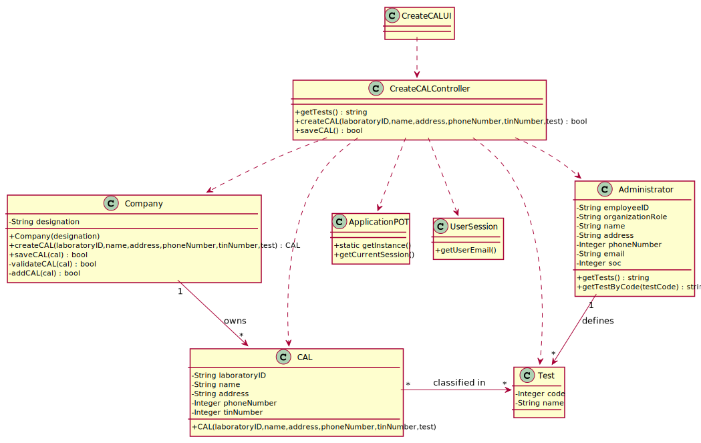

# US 008 - To register a Clinical Analysis Laboratory

## 1. Requirements Engineering

### 1.1. User Story Description

As an administrator, I want to register a new clinical analysis laboratory stating which kind of test(s) it operates.

### 1.2. Customer Specifications and Clarifications 

**From the Specifications Document:**

>	(none)

**From the client clarifications:**

> **Question:** What are the data that characterize a clinical analysis laboratory?
>  
> **Answer:** Consider a laboratoryID, a name, an address, a phoneNumber and a tinNumber.

-

> **Question:** When registering a new laboratory does the administrator selects or write the type of tests performed by a clinical Analysis laboratory?
>  
> **Answer:** Yes. In Sprint B requirements we get: "US8: As an administrator, I want to register a new clinical analysis laboratory stating which kind of test(s) it operates".

-

> **Question:** When creating a new Clinical Analysis Laboratory, should the system automatically record that it operates that type of test or should the person who is creating it select it manually while selecting other types of tests? Or other option?
>  
> **Answer:** The administrator should select, manually, all the types of tests to be performed by the Clinical Analysis Laboratory.

-

> **Question:** Of all the information that we have about the CLA, what would be the bare minimum to be able to successfully register a new CLA? 
>  
> **Answer:** All information is required.

### 1.3. Acceptance Criteria

* **AC1:** A CAL's must have an attribute specifying if it performs Covid-19 Test.
* **AC2:** A CAL's must always perform blood tests.
* **AC3:** A CAL cannot be registered without Laboratory ID, Name, Address, Phone Number, TIN number and the information if it performs Covid-19 Tests.
* **AC4:** The laboratoryID must have five alphanumeric characters.
* **AC5:** The name must be a string with no more than 20 characters.
* **AC6:** The address must be a string with no more than 30 characters.
* **AC7:** The phoneNumber must be a 11 digit number.
* **AC8:** The tinNumber must be a 10 digit number.

### 1.4. Found out Dependencies

* There is a dependency to "US009  Create type of test and its collecting methods" since at least a type of test must exist to register a new clinical analysis laboratory.

### 1.5 Input and Output Data

**Input Data:**

* Typed data:
	* a laboratoryID
	* a name
	* an address
    * a phoneNumber
    * a tinNumber
	
* Selected data:
	* type(s) of test

**Output Data:**

* List of existing types of test
* (In)Success of the operation

### 1.6. System Sequence Diagram (SSD)

**Alternative 1**

**Alternative 2**

### 1.7 Other Relevant Remarks

No Relevant Remarks were found. 

## 2. OO Analysis

### 2.1. Relevant Domain Model Excerpt 

### 2.2. Other Remarks

n/a

## 3. Design - User Story Realization 

### 3.1. Rationale

**SSD - Alternative 1 is adopted.**

| Interaction ID | Question: Which class is responsible for... | Answer  | Justification (with patterns)  |
|:-------------  |:--------------------- |:------------|:---------------------------- |
| Step 1  		 |	... interacting with the actor? | CreateCALUI   |  Pure Fabrication: there is no reason to assign this responsibility to any existing class in the Domain Model.           |
| 			  		 |	... coordinating the US? | CreateCALController | Controller                             |
| 			  		 |	... instantiating a new CAL? | Administrator   | Creator: R1   |
| 			  		 | ... knowing the user using the system?  | UserSession  | IE: cf. A&A component documentation.  |
| Step 2  		 |							 |             |                              |
| Step 3  		 |	...saving the inputted data? | CAL  | IE: object created in step 1 has its own data.  |
| Step 4  		 |	...knowing the test types to show? | Administrator  | IE: Test types are defined by the Administrator. |
| Step 5  		 |	... saving the selected type of test? | CAL | IE: object created in step 1 is classified in one or more Type of Test.  |
| Step 6  		 |							 |             |                              |              
| Step 7  		 |	... validating all data (local validation)? | CAL | IE: owns its data.| 
| 			  		 |	... validating all data (global validation)? | Company | IE: knows all its CALs.| 
| 			  		 |	... saving the created CAL? | Company | IE: owns all its CALs.| 
| Step 8  		 |	... informing operation success?| CreateCALUI  | IE: is responsible for user interactions.  | 

### Systematization ##

According to the taken rationale, the conceptual classes promoted to software classes are: 

 * Company
 * Administrator
 * CAL

Other software classes (i.e. Pure Fabrication) identified: 

 * CreateCALUI  
 * CreateCALController

## 3.2. Sequence Diagram (SD)

**Alternative 1**

**Alternative 2**

## 3.3. Class Diagram (CD)

**From alternative 1**

# 4. Tests 

**Test 1:** Check that it is not possible to create an instance of the CAL class with null values - AC3. 

    @Test(expected = IllegalArgumentException.class)
    public void ensureReferenceMeetsAC3() {
            CAL instance = new CAL(null, null, null, null, null, null);
        }
	
**Test 2:** Check that it is not possible to create an instance of the CAL class with a laboratoryID not containing five chars - AC4. 

    @Test(expected = IllegalArgumentException.class)
    public void ensureReferenceMeetsAC4() {
        CAL instance = new CAL("123", "Laboratory", "Rua das Pedras", "12345678901", "1234567890", "test");
    }
    
**Test 3:** Check that it is not possible to create an instance of the CAL class with a name containing more than 20 chars - AC5. 

    @Test(expected = IllegalArgumentException.class)
    public void ensureReferenceMeetsAC5() {
        CAL instance = new CAL("12345", "Clinical Analysis Laboratory", "Rua das Pedras", "12345678901", "1234567890", "test");
    }
    
**Test 4:** Check that it is not possible to create an instance of the CAL class with an address containing more than 30 chars - AC6. 

    @Test(expected = IllegalArgumentException.class)
    public void ensureReferenceMeetsAC6() {
        CAL instance = new CAL("12345", "Laboratory", "Rua das Pedras 345B 3ºesq. 1234-576 Espinho, Aveiro", "12345678901", "1234567890", "test");
    }
    
**Test 5:** Check that it is not possible to create an instance of the CAL class with a phoneNumber not containing 11 chars - AC7. 

    @Test(expected = IllegalArgumentException.class)
    public void ensureReferenceMeetsAC7() {
        CAL instance = new CAL("12345", "Laboratory", "Rua das Pedras", "123456789", "1234567890", "test");
    }
    
**Test 6:** Check that it is not possible to create an instance of the CAL class with a tinNumber not containing 10 chars - AC8. 

    @Test(expected = IllegalArgumentException.class)
    public void ensureReferenceMeetsAC8() {
        CAL instance = new CAL("12345", "Laboratory", "Rua das Pedras", "12345678901", "123456789", "test");
    }

# 5. Construction (Implementation)

## Class CreateCALController 

    private Company company;
    private CAL cal;
    private Test test;

    public Test getTests(String test)
    {
        return this.test;
    }
	
    public boolean createCAL(String laboratoryID, String name, String address, String phoneNumber, String tinNumber, String test)
    {
        this.cal = this.company.createCAL(laboratoryID, name, address, phoneNumber, tinNumber, test);
        return this.company.validateCAL(cal);
    }

    public boolean saveCAL()
    {
        return this.company.saveCAL(cal);
    }

## Class Company

    private String designation;
    private AuthFacade authFacade;
    private List<CAL> CALList;
    
    public Company(String designation)
    {
        if (StringUtils.isBlank(designation))
            throw new IllegalArgumentException("Designation cannot be blank.");

        this.designation = designation;
        this.authFacade = new AuthFacade();
        this.CALList = new ArrayList<>();
    }

    public CAL createCAL(String laboratoryID, String name, String address, String phoneNumber, String tinNumber, String test)
    {
        return new CAL(laboratoryID, name, address, phoneNumber, tinNumber, test);
    }

    public boolean saveCAL(CAL cal) {
        if (!validateCAL(cal))
            return false;
        return this.CALList.add(cal);
    }

    public boolean validateCAL(CAL cal) {
        if (cal == null)
            return false;
        return ! this.CALList.contains(cal);
    }

    public boolean addCAL(CAL cal)
    {
        return this.CALList.add(cal);
    }		

## Class CAL

    private String laboratoryID;
    private String name;
    private String address;
    private String phoneNumber;
    private String tinNumber;
    private String test;

    public CAL(String laboratoryID, String name, String address, String phoneNumber, String tinNumber, String test)
    {
        checklaboratoryID(laboratoryID);
        checkName(name);
        checkAddress(address);
        checkphoneNumber(phoneNumber);
        checktinNumber(tinNumber);

        this.laboratoryID = laboratoryID;
        this.name = name;
        this.address = address;
        this.phoneNumber = phoneNumber;
        this.tinNumber = tinNumber;
        this.test = test;
    }

## Class Administrator

    private List<CAL> CALList;
    private Test test;

    public Test getTests()
    {
        return this.test;
    }

    public String getTestbyCode(String testCode)
    {
        return this.test.getTestCode(testCode);
    }

# 6. Integration and Demo 

* A new option on the Admin menu options was added.

# 7. Observations

Company class is getting too many responsibilities due to IE pattern and, therefore, it is becoming huge and harder to maintain. 

Is there any way to avoid this to happen?

