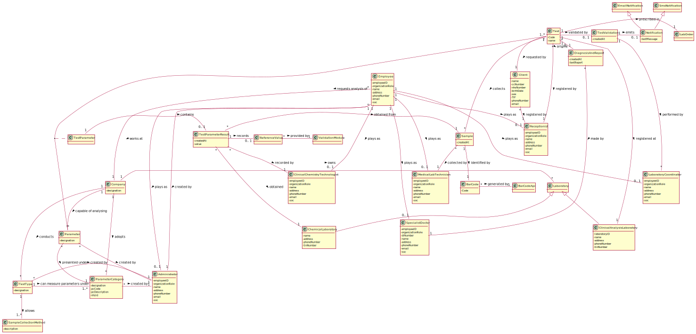

# OO Analysis #

## Rationale to identify domain conceptual classes ##

### _Conceptual Class Category List_ ###

**Business Transactions**

Test

---

**Transaction Line Items**

TestParameterResult,
Sample

---

**Product/Service related to a Transaction or Transaction Line Item**

Parameter,
TestParameter,
TestParameterResult,
TestType,
ParameterCategory,
DiagnosisResult,
TestValidation
SampleCollectionMethod

---

**Transaction Records**

TestParameterResult,
DiagnosisResult,

---  

**Roles of People or Organizations**

Receptionist,
Client,
Medical Lab Technician,
Specialist Doctor,
Laboratory Coordinator,
Clinical Chemistry Technologist,
Administrator.
Employee

---

**Places**

Clinical Analysis Laboratory,
Chemical Laboratory

---

**Noteworthy Events**

DiagnosisResult,
TestValidation
TestParameterResult

---

**Physical Objects**

Sample,
Test,
LabOrder

---

**Descriptions of Things**

TestType,
ParameterCategory,
Parameter,
TestParameter,
TestParameterResult
TestValidation

---

**Catalogs**

DiagnosisResult

---

**Containers**

ClinicalAnalysisLaboratory,
ChemicalLaboratory

---

**Elements of Containers**

Sample,
Test

---

**Organizations**

Company, National Healthcare Service (NHS)

---

**Other External/Collaborating Systems**

National Healthcare Service (NHS)

---

**Records of finance, work, contracts, legal matters**

Company

---

**Financial Instruments**

TIF

---

**Documents mentioned/used to perform some work/**

TestParameterResult,
DiagnosisResult

---

| Concept (A) 		|  Association   	|  Concept (B) |
|----------	   		|:-------------:		|------:       |
| Company | conducts | TestType |
|	| owns | Laboratory |
|	| capable of analysing | Parameter |
|	| adopts | ParameterCategory |
| Employee | plays as | Receptionist |
|	| plays as | Medical Lab Technician |
|	| plays as | Clinical Chemistry Technologist |
|	| plays as | Specialist Doctor |
|	| plays as | Laboratory Coordinator |
|	| plays as | Administrator |
|	| works at | Company |
|	| created by | Administrator |
| Parameter | presented under | ParameterCategory |
|	| created by | Administrator |
| ParameterCategory | created by | Administrator |
| TestType | can measure parameters under | ParameterCategory |
|   | created by | Administrator  |
|   | allows | SampleCollectionMethod  |
| ClinicalAnalysisLaboratory | conducts	| TestType |
| Client | registered by | Receptionist |
| Test | requested by | Client |
|	| registered at | ClinicalAnalysisLaboratory |
|	| collects | Sample |
|	| requests analysis of | Parameter |
|	| registed by | Receptionist   |
|	| prescribed in | LabOrder   |
|	| origins | DiagnosisReport   |
|	| validated by | TestValidation   |
| DiagnosisAndReport | made by | SpecialistDoctor |
| TestValidation | emits | Notification|
|	| performed by | LaboratoryCoordinator   |
| TestParameter | contains | TestParameterResult |
| TestParameterResult | obtained | ChemicalLaboratory |
|	| recorded by | ClinicalChemistryTechnologist   |
|	| records | ReferenceValue   |
|	| obtained from | Sample   |
| ReferenceValue | provided by | ValidationModule |
| Sample | collected by | MedicalLabTechinician |
|	| idetified by | BarCode   |
| BarCode | generated by | BarCodeApi |

## Domain Model

