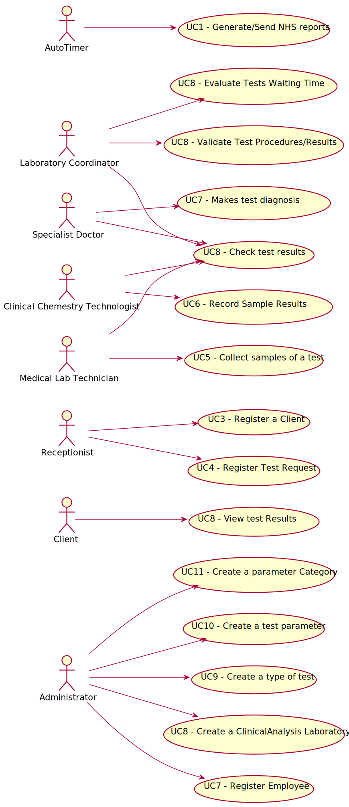

# Use Case Diagram (UCD)

# Use Cases / User Stories
| UC/US  | Description |                   
|:----|:------------------------------------------------------------------------|
| US1 | [RegisterClient](US1.md)|
| US2 | [RegisterTestRequest](US2.md)|
| US3 | [RecordTestSamples](US3.md)|
| US4 | [RecordChemicalAnalysis´sResults](US4.md)|
| US5 | [DiagnoseAndWriteReport](US5.md)|
| US6 | [ValidateReportAndResults](US6.md)|
| US7 | [RegisterNewEmployee](US7.md)|
| US8 | [RegisterNewClinicalAnalysisLaboratory](US8.md)|
| US9 | [CreateTypeOfTest](US9.md)|
| US10 | [CreateParameter](US10.md)|
| US11 | [CreateParameterCategory](US11.md)|
