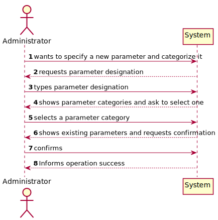
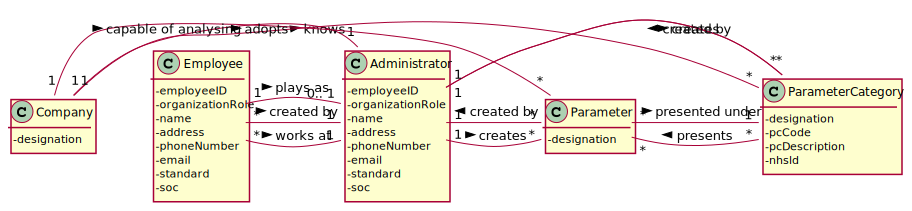
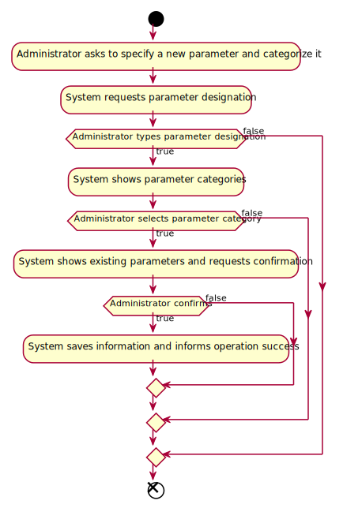
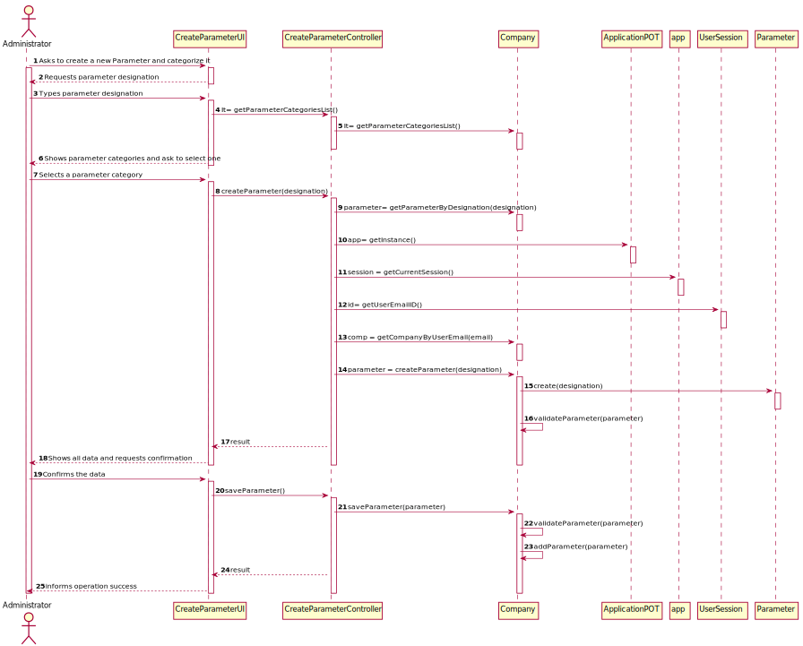
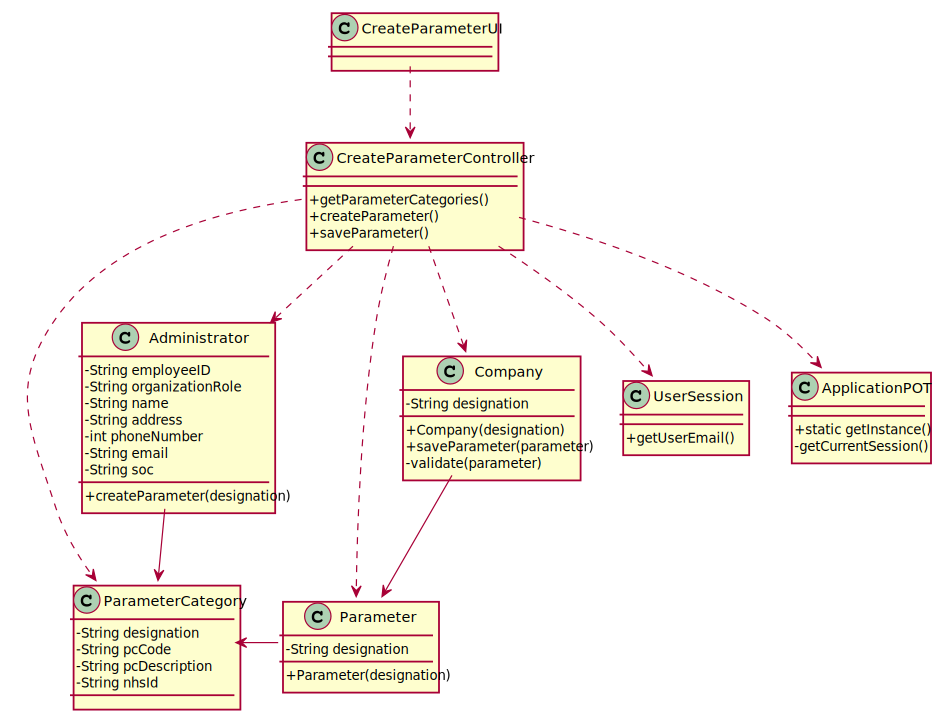

# US 010 - Specify a new parameter and categorize it.

## 1. Requirements Engineering

### 1.1. User Story Description

As an administrator, I want to specify a new parameter and categorize it

### 1.2. Customer Specifications and Clarifications 

**From the Specifications Document:**

 (none)

>	

**From the client clarifications:**

> **Question:** Is the administrator an employee? If he/she is, who does him/her register?
>  
> **Answer:** Yes. An administrator should be registered when the application starts for first time.
The application can have more than one administrator.

> **Question:** How does the assignment of a parameter category works? Does he have to select the category or he have the option to create in the moment?
>
> **Answer:** There exists a user story to specify a new parameter category. Therefore, the administrator should select one category when creating a parameter.

> **Questio:** When specifying more than one parameter at the same time, all that parameters will be categorized to one single category or should I ask the category to each parameter?
>
> **Answer:** You should always ask the category of each parameter.

### 1.3. Acceptance Criteria

* **AC1:** The administrator needs to be logged in.
* **AC2:** Each parameter must be presented under only one category.

### 1.4. Found out Dependencies

There is a dependency to US11 (Administrator specifies a new parameter category).

### 1.5 Input and Output Data

**Input Data:**

* Typed data:
	* designation

* Selected data:
    * Parameter Category

**Output Data:**

 * List of existing parameters
 
 * (In)Success of the operation

### 1.6. System Sequence Diagram (SSD)

### 1.7 Other Relevant Remarks

No Relevant Remarks were found.

## 2. OO Analysis

### 2.1. Relevant Domain Model Excerpt 
*In this section, it is suggested to present an excerpt of the domain model that is seen as relevant to fulfill this requirement.* 

### 2.2. Other Remarks

## 3. Design - User Story Realization 

### 3.1. Rationale

**The rationale grounds on the SSD interactions and the identified input/output data.**

| Interaction ID | Question: Which class is responsible for... | Answer  | Justification (with patterns)  |
|:-------------  |:--------------------- |:------------|:---------------------------- |
| Step 1  		 |  ... interacting with the actor?  | CreateParameterUI | Pure Fabrications: there is no reason to assign this responsibility to any existing class in the Domain Model. |
|   		 |	... coordinating the US?  |  CreateParameterController  | Controller |
|   		 |	...instantiating a new parameter | Administrator  | Creator: R1 |
|            |  ... knowing the user using the system?  |  UserSession  |  IE: cf. A&A component documentation.  |
| Step 2         |                           |             |                              |
| Step 3         |  ...saving the inputted data?  | Parameter |  IE: object created in step 1 has its own data |
| Step 4  		 |	...knowing the parameter categories to show?  |  Administrator  |  IE: Parameter Categories are defined by the Administrator.  |
| Step 5  		 | ... saving the selected parameter category? | Parameter | IE: object created in step 1 is classified in one Parameter Category. |

### Systematization ##

According to the taken rationale, the conceptual classes promoted to software classes are: 

 * Administrator

 * Parameter
 
 * Company

Other software classes (i.e. Pure Fabrication) identified: 

 * CreateParameterUI 
 
 * CreateParameterController

## 3.2. Sequence Diagram (SD)

## 3.3. Class Diagram (CD)

# 4. Tests 
*In this section, it is suggested to systematize how the tests were designed to allow a correct measurement of requirements fulfilling.* 

**_DO NOT COPY ALL DEVELOPED TESTS HERE_**

**Test 1:** Check that it is not possible to create an instance of the Example class with null values. 

	@Test(expected = IllegalArgumentException.class)
		public void ensureNullIsNotAllowed() {
		Exemplo instance = new Exemplo(null, null);
	}

*It is also recommended to organize this content by subsections.* 

# 5. Construction (Implementation)

# Class CreateParameterController

    private Company company;
    private Parameter parameter;
    public CreateParameterController()
    {
        this(App.getInstance().getCompany());
    }

    public CreateParameterController(Company company)
    {
        checkUserAuth();
        this.company = company;
        this.parameter = null;
    }

    private void checkUserAuth() {
        boolean loggedInWithRole = App.getInstance().getCurrentUserSession().isLoggedInWithRole(Constants.ROLE_ADMIN);
        if (!loggedInWithRole)
            throw new IllegalStateException("User has no permission to do this operation.");
    }

    public boolean createParameter(String description)
    {
        this.parameter = this.company.createParameter(description);
        return this.company.validateParameter(parameter);
    }

    public boolean saveParameter()
    {
        return this.company.saveParameter(parameter);
    }

# 6. Integration and Demo 

*In this section, it is suggested to describe the efforts made to integrate this functionality with the other features of the system.*

 
# 7. Observations

*In this section, it is suggested to present a critical perspective on the developed work, pointing, for example, to other alternatives and or future related work.*

 

