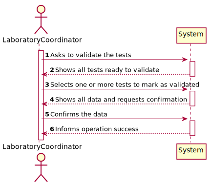
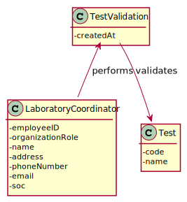
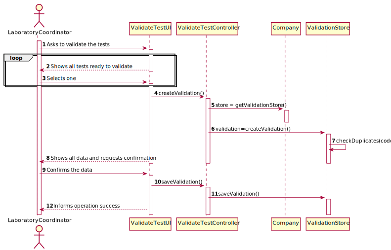
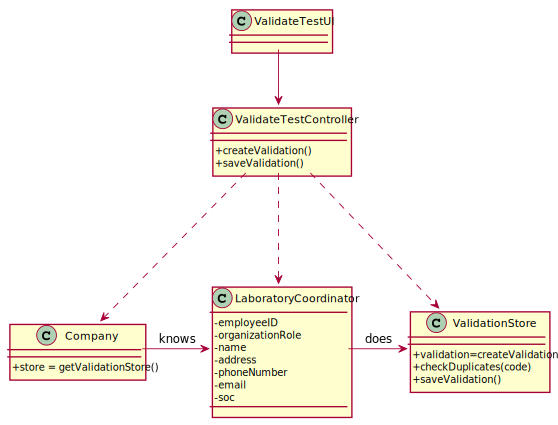

# US 015 - Validate the tests

## 1. Requirements Engineering

### 1.1. User Story Description

 As a laboratory coordinator, I want to validate the work done by the clinical chemistry
technologist and specialist doctor.

### 1.2. Customer Specifications and Clarifications 

**From the Specifications Document:**

>   After the specialist doctor has completed the diagnosis, the results of the clinical analyses and the
    report become available in the system and must be validated by the laboratory coordinator.
    
>   To validate the work done, the laboratory coordinator checks the chemical test/result and associated
    diagnosis made and confirms that everything was done correctly
    
>   Once the laboratory coordinator confirms that everything was done correctly, the client receives a notification alerting that the results are already available in the central application and informing that he/she must access the application to view those results.
    The client receives the notification by SMS and e-mail.

**From the client clarifications:**

>   **Question:** 
>   Should the laboratory coordinator validate the test results one by one or should he do only one validation of all of them?
>
>   **Answer:** 
>   The coordinator can validate all or a subset of test results. The system does not show client personal information but shows all dates (test registration date, chemical analysys date and diagnosis date).

-

>   **Question:** 
>   When the laboratory coordinator wants to validate a test does all the tests available show up for him or does he search using a code that identifies a specific test?
>
>   **Answer:** 
>   The system shows all tests ready to validate (tests that already have the test registration date, the chemical analysys date and the diagnosis date registered in the system) and the laboratory coordinator selects one or more tests to mark as validated.

-

>   **Question:** 
>   What should happen to a test if either the test report or the results are invalid? Should we prompt for a redo of either process or simply erase the test?
>
>   **Answer:** 
>   The laboratory coordinator only sees the test dates of tests that already have all dates registered in the system (test registration date, the chemical analysys date and the diagnosis date).

-

>   **Question:** 
>   Regarding the process of validating a certain test/result, what validation states should be considered by the laboratory coordinator? For example, can "Valid" or "Invalid" be accepted as a confirmation for the chemical test/result and its diagnosis?
>
>   **Answer:** 
>   Only Valid state. The system shows all tests ready to validate (tests that already have the test registration date, the chemical analysys date and the diagnosis date registered in the system) and the laboratory coordinator selects one or more tests to mark as validated.

### 1.3. Acceptance Criteria

* **AC1:** The system does not show client personal information but shows all dates (test registration date, chemical analysis date and diagnosis date).
* **AC2:** The laboratory coordinator only sees the test dates of tests that already have all dates registered in the system (test registration date, the chemical analysys date and the diagnosis date). 

### 1.4. Found out Dependencies

There is a dependency to US014 (Specialist doctor makes the diagnosis and writes a report for a test.)

### 1.5 Input and Output Data

**Input Data:**

* Selected Data:

      - Tests
 
**Output Data:**

 * Validated Tests

### 1.6. System Sequence Diagram (SSD)

### 1.7 Other Relevant Remarks

No relevant remarks were found.

## 2. OO Analysis

### 2.1. Relevant Domain Model Excerpt 

### 2.2. Other Remarks

No relevant remarks were found.

## 3. Design - User Story Realization 

### 3.1. Rationale

**The rationale grounds on the SSD interactions and the identified input/output data.**

| Interaction ID | Question: Which class is responsible for... | Answer  | Justification (with patterns)  |
|:-------------  |:--------------------- |:------------|:---------------------------- |
| Step 1  		 | ... interacting with the actor? | ValidateTestUI |  There is no reason to assign this responsibility to any existing class in the Domain Model.  |
|   		 |	... coordinating the US? |  ValidateTestController  |  Controller  |
|   		 |	... validating tests? | LaboratoryCoordinator  |    |
|            | ... knowing the user using the system? | UserSession | 	|
| Step 2  		 | ...knowing the tests to show? | Company  |                              |
| Step 3  		 |	...saving the inputted data? | ValidationStore |                              |
| Step 4  		 |	 |  |                              |
| Step 5  		 | ... validating all data (local validation)? | LaboratoryCoordinator |                              |
|       |... validating all data (global validation)?| Company |
|       |... saving the created Test Validation? | Company |
| Step 6  |	... saving the created Report and Diagnose? | ValidateTestUI |    |              

### Systematization ##

According to the taken rationale, the conceptual classes promoted to software classes are: 

 * Company
 * LaboratoryCoordinator

Other software classes (i.e. Pure Fabrication) identified: 

 * ValidateTestUI  
 * ValidateTestController

## 3.2. Sequence Diagram (SD)

## 3.3. Class Diagram (CD)

# 4. Tests 
*In this section, it is suggested to systematize how the tests were designed to allow a correct measurement of requirements fulfilling.* 

**_DO NOT COPY ALL DEVELOPED TESTS HERE_**

**Test 1:** Check that it is not possible to create an instance of the Example class with null values. 

	@Test(expected = IllegalArgumentException.class)
		public void ensureNullIsNotAllowed() {
		Exemplo instance = new Exemplo(null, null);
	}

*It is also recommended to organize this content by subsections.* 

# 5. Construction (Implementation)

   

## Class ValidateTestController
   
       package app.controller;
    import java.util.ArrayList;

    public class ValidateTestController { 

    private Company company;
    private Test test;
    private ArrayList<Test> testList;
    public ValidateTestController()
    {
        this(App.getInstance().getCompany());
    }

    public ValidateTestController(Company company)
    {
        checkUserAuth();
        this.company = company;
        this.test = test;
        this.testList = company.getTestList();
    }

    private void checkUserAuth() {
        boolean loggedInWithRole = App.getInstance().getCurrentUserSession().isLoggedInWithRole(Constants.ROLE_LABORATORYCOORDINATOR);
        if (!loggedInWithRole)
            throw new IllegalStateException("User has no permission to do this operation.");
    }

    public Test getTest() {
        return test;
    }

    public ArrayList<Test> getTestList() {
        return testList;
    }

    public boolean saveValidation()
    {
        return this.company.saveValidation();
    }

    }

## Class ValidateTestUI

    package app.ui.console;

    import app.controller.ValidateTestController;
    

    private ValidateTestController ctrl;

    public ValidateTestUI() {
        this.ctrl = new ValidateTestController();
    }

    @Override
    public void run() {
        System.out.println("\n Validating tests: \n");
        try {
            if (readData())
            {
                if (Utils.confirm("Do you confirm the validation (Y/N)")) {
                    if (this.ctrl.saveValidation()) {
                        System.out.println("Record save with success.");
                    } else {
                        System.out.println("An error occurred while attempting to save the record.");
                    }
                }
            }
            else
            {
                System.out.println("Provided information already exists.");
            }
        }catch(Exception ex)
        {
            System.out.println("Ocorreu um erro: operação cancelada. \n" + ex.getMessage());
        }
    }

    private boolean readData() {

        List<TestItem> options = new ArrayList<>();
        for (Test test:
                ctrl.getTestList()) {
            if (!test.getState().equals("Valid")) options.add(new TestItem("Code: "+test.getTestCode()+" Date: "+test.getDate(),test));
        }

        int option = 0;
        do
        {
            option = Utils.showAndSelectIndex(options, "\n\nSelect the test to validate:");
            System.out.println("Option: " + option);
            if ( (option >= 0) && (option < options.size()))
            {
                options.get(option).getTest().setState("Valid");
                options.remove(option);
            }
        }
        while (option != -1);

        return ctrl.saveValidation();
    }

    }
    
    
    
## Class LaboratoryCoordinatorUI

    
    import java.util.List;

    public class LaboratoryCoordinatorUI implements Runnable{

    public LaboratoryCoordinatorUI()
    {
    }

    public void run()
    {
        List<MenuItem> options = new ArrayList<MenuItem>();
        options.add(new MenuItem("Validate Tests", new ValidateTestUI()));

        int option = 0;
        do
        {
            option = Utils.showAndSelectIndex(options, "\n\nLaboratory Coordinator Menu:");

            if ( (option >= 0) && (option < options.size()))
            {
                options.get(option).run();
            }
        }
        while (option != -1 );
    }
    }
    

# 6. Integration and Demo 

* Laboratory Coordinator menu was created.
* Test Validation option was created in Laboratory Coordinator menu.

# 7. Observations

n/a
