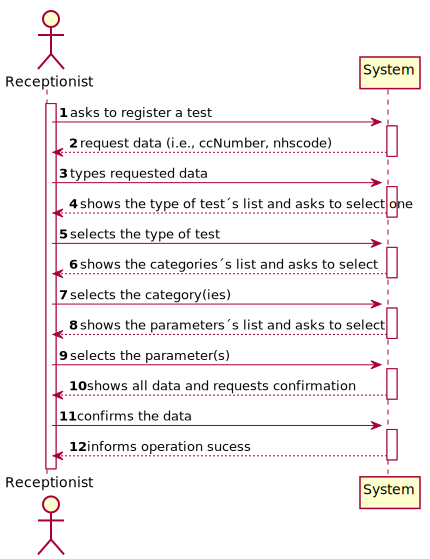
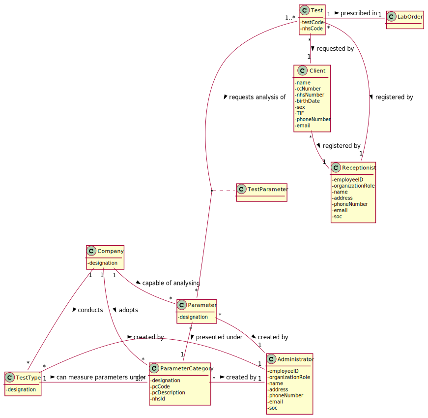
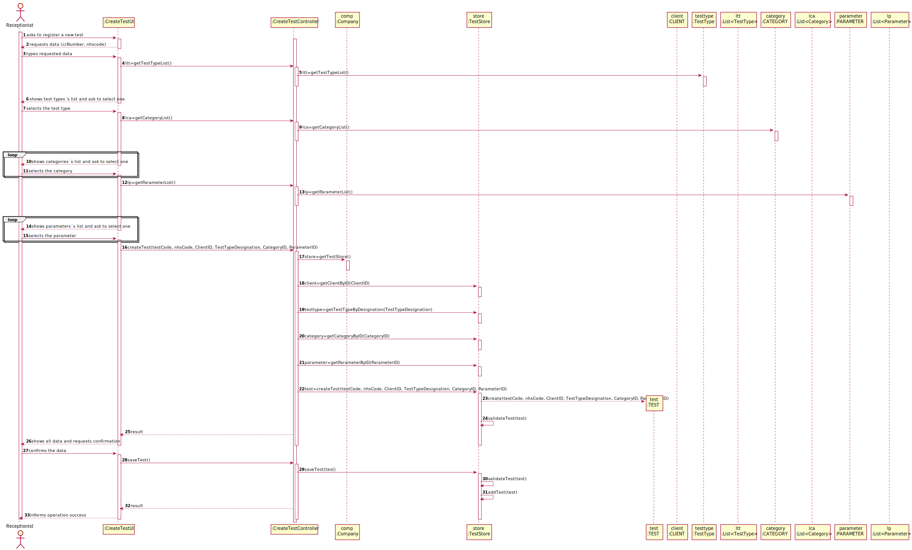
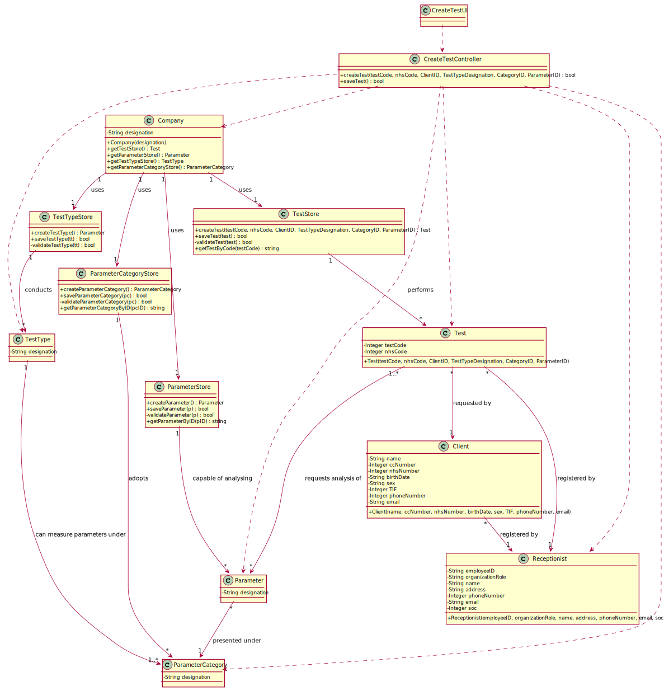

# US 004 - To register a test

## 1. Requirements Engineering

### 1.1. User Story Description

As a receptionist of the laboratory, I intend to register a test to be performed to a registered client.

### 1.2. Customer Specifications and Clarifications 

**From the specifications document:**

>	Once there, a receptionist asks the client’s citizen card number, the lab order (which contains the type of
 test and parameters to be measured), and registers in the application the test to be performed to that client.

**From the client clarifications:**

> **Question:** What are the necessary parameters according to the type of test?
>
> **Answer:** Each parameter is associated with one category. Each parameter has a Code, a Short Name and a Description. 
The Code are five alphanumeric characters. The Short Name is a String with no more than 8 characters. The Description is a String with no more than 20 characters.

-

> **Question:** When the receptionist chooses the test type, should the categories appear, and then when selecting the category, 
the receptionist can choose the parameters for the test? Or when the Receptionist chooses the test type, should appear all the parameters that it includes immediately?
>  
> **Answer:** Firstly, the receptionist should choose a test type. Then choose a category from a set of categories. Last, the receptionist should choose a parameter.

-

> **Question:**: What are the attributes of a test and the acceptance criteria?
>  
> **Answer:** A test has the following attributes:
Test code : Sequential number with 12 digits. The code is automatically generated.
NHS code: 12 alphanumeric characters.

-

> **Question:**: Since the Client has a Lab Order which contains the type of test and all the parameters to be measured, 
all the parameters selected by the Receptionist need to be equal to the Lab Order's parameters?
>  
> **Answer:** Yes.

-

> **Question:**: About the other Test attributes, do we need to have in consideration any other criteria? Is the code generated or NHS code ooptional?
>  
> **Answer:** All test attributes are mandatory. The test attributes are the following:
Test code : sequential number with 12 digits. The code is automatically generated.
NHS code: 12 alphanumeric characters.

### 1.3. Acceptance Criteria

* **AC1:** The receptionist must select the parameters to be analysed from all possible parameters in accordance with the test type.
* **AC2:** All the test´s atributes are mandatory.
* **AC3:** The test code must be a sequential number with 12 digits and the code is generated automatically.
* **AC4:** The nhs code must be a 12 alphanumeric characters.

### 1.4. Found out Dependencies

* There is a dependency to "US3 Register a client" since at least a client must be registered to register a test.

### 1.5 Input and Output Data

**Input Data:**

* Typed data:
    * a ccNumber
    * a nhs code
	
* Selected data:
	* Selecting test type(s)
    * Selecting category(ies)
    * Selecting parameter(s)

**Output Data:**

* List of existing types of test
* List of existing categories
* List of existing parameters
* (In)Success of the operation

### 1.6. System Sequence Diagram (SSD)

**Alternative 1**

### 1.7 Other Relevant Remarks

n/a

## 2. OO Analysis

### 2.1. Relevant Domain Model Excerpt 

### 2.2. Other Remarks

n/a

## 3. Design - User Story Realization 

### 3.1. Rationale

**SSD - Alternative 1 is adopted.**

| Interaction ID | Question: Which class is responsible for... | Answer  | Justification (with patterns)  |
|:-------------  |:--------------------- |:------------|:---------------------------- |
| Step 1  		 |	... interacting with the actor? | CreateTestUI   |  Pure Fabrication: there is no reason to assign this responsibility to any existing class in the Domain Model.           |
| 			  		 |	... coordinating the US? | CreateTestController | Controller                             |
| 			  		 |	... instantiating a new Test? | Receptionist | Creator: R1   |			  	
| Step 2  		 |							 |             |                              |
| Step 3  		 |	...saving the inputted data? | Test  | IE: object created in step 1 has its own data.  |
| Step 4  		 |	...knowing the test types to show? | Administrator | IE: Test types are defined by the Administrator. |
| Step 5  		 |	... saving the selected type of test? | Test | IE: object created in step 1 is classified in one Type of Test.  |
| Step 6  		 |	...knowing the categories to show? | Administrator | IE: Categories are defined by the Administrator. |
| Step 7  		 |	... saving the selected category(ies)? | Test | IE: object created in step 1 is classified in one or more Categories.  |
| Step 8  		 |	...knowing the parameters to show? | Administrator | IE: Parameters are defined by the Administrator. |
| Step 9  		 |	... saving the selected parameter(s)? | Test | IE: object created in step 1 is classified in one or more Parameters.  |
| Step 10  		 |							 |             |                              |              
| Step 11  		 |	... validating all data (local validation)? | Test | IE: owns its data.| 
| 			  		 |	... validating all data (global validation)? | Company | IE: knows all its Tests.| 
| 			  		 |	... saving the created Test? | TestStore | IE: owns all its Tests.| 
| Step 12  		 |	... informing operation success?| CreateTestUI  | IE: is responsible for user interactions.  | 

### Systematization ##

According to the taken rationale, the conceptual classes promoted to software classes are: 

 * Company
 * Receptionist
 * Administrator
 * Test
 * TestStore

Other software classes (i.e. Pure Fabrication) identified: 

 * CreateTestUI  
 * CreateTestController

## 3.2. Sequence Diagram (SD)

**Alternative 1**

## 3.3. Class Diagram (CD)

**From alternative 1**

# 4. Tests 
	
**Test 1:** Check that it is not possible to create an instance of the Test class with a nhs code being null. 

    @Test(expected = IllegalArgumentException.class)
    public void ensureNhsCodeNotNull()
    {
        Company company = new Company("ManyLabs");

        long testCode = 12345;

        long nhsCode = Long.parseLong(null);

        String textDesignation = "Designation";

        long ccNumber = 1234567890123456L;

        String testType = "Blood";

        ArrayList<String> testParameterCategoryList = new ArrayList<>();
        ArrayList<String> testParameterList = new ArrayList<>();

        testParameterCategoryList.add("CategoryName");
        testParameterList.add("ParName");

        String state = "Valid";

        Calendar calendar = Calendar.getInstance();

        Date date = calendar.getTime();

        app.domain.model.Test test = company.testingTest(testCode, nhsCode, textDesignation, ccNumber, testType, testParameterCategoryList, testParameterList, state, date);
        System.out.println(company.testingTest(testCode, nhsCode, textDesignation, ccNumber, testType, testParameterCategoryList, testParameterList, state, date));
    }
**Test 2:** Check that it is not possible to create an instance of the Test class with a nhs code not containing more than 12 digits. 

    @Test(expected = IllegalArgumentException.class)
    public void ensureNhsCodeNotBiggerThan12Digits()
    {
        Company company = new Company("ManyLabs");

        long testCode = 12345;

        long nhsCode = 1234567890123L;

        String textDesignation = "Designation";

        long ccNumber = 1234567890123456L;

        String testType = "Blood";

        ArrayList<String> testParameterCategoryList = new ArrayList<>();
        ArrayList<String> testParameterList = new ArrayList<>();

        testParameterCategoryList.add("CategoryName");
        testParameterList.add("ParName");

        String state = "Valid";

        Calendar calendar = Calendar.getInstance();

        Date date = calendar.getTime();

        app.domain.model.Test test = company.testingTest(testCode, nhsCode, textDesignation, ccNumber, testType, testParameterCategoryList, testParameterList, state, date);
        System.out.println(company.testingTest(testCode, nhsCode, textDesignation, ccNumber, testType, testParameterCategoryList, testParameterList, state, date));
    }
# 5. Construction (Implementation)

## Class CreateTestController 

    private Company company;
    private CAL cal;
    private Test test;

    public Test getTests(String test)
    {
        return this.test;
    }
	
    public boolean createTest(long testCode, long nhsCode, String textDesignation, long ccNumber, String testType, ArrayList<String> testParameterCategoryList, ArrayList<String> testParameterList, String state, Date date)
    {
        this.cal = this.company.createTest(testCode, nhsCode, textDesignation, ccNumber, testType, testParameterCategoryList, testParameterList, state, date);
        return this.company.validateTest(test);
    }

    public boolean saveTest()
    {
        return this.company.saveTest(test);
    }

## Class Company

    private String designation;
    private AuthFacade authFacade;
    private List<Test> TestList;
    
    public Company(String designation)
    {
        if (StringUtils.isBlank(designation))
            throw new IllegalArgumentException("Designation cannot be blank.");

        this.designation = designation;
        this.authFacade = new AuthFacade();
        this.TestList = new ArrayList<>();
    }

    public Test createTest(long testCode, long nhsCode, String textDesignation, long ccNumber, String testType, ArrayList<String> testParameterCategoryList, ArrayList<String> testParameterList, String state, Date date)
    {
        return new Test(testCode, nhsCode, textDesignation, ccNumber, testType, testParameterCategoryList, testParameterList, state, date);
    }

    public boolean saveTest(Test test) {
        if (!validateTest(test))
            return false;
        return this.TestList.add(test);
    }

    public boolean validateTest(Test test) {
        if (test == null)
            return false;
        return ! this.TestList.contains(test);
    }

    public boolean addTest(Test test)
    {
        return this.TestList.add(test);
    }		

## Class Test

    private long testCode;
    private long nhsCode;
    private String testDesignation;
    private long ccNumber;
    private String testType;
    private ArrayList<String> parameterCategoryList;
    private ArrayList<String> parameterList;
    public String state;
    private Date date;

    public CAL(String testcode, String testname, String testtype)
    {
        checkTestCode(testCode);
        checkNhsCode(nhsCode);
        checkTestDesignation(testDesignation);
        checkCardNumber(ccNumber);
        checkTestType(testType);
        checkParameterCategoryList(parameterCategoryList);
        checkParameterList(parameterList);

        this.testCode = testCode;
        this.nhsCode = nhsCode;
        this.testDesignation = testDesignation;
        this.ccNumber = ccNumber;
        this.testType = testType;
        this.parameterCategoryList = parameterCategoryList;
        this.parameterList = parameterList;
        this.state = state;
        this.date = date;
    }

## Class Receptionist

    private List<Test> TestList;
    private Test test;

    public Test getTests()
    {
        return this.test;
    }

    public String getTestbyCode(String testCode)
    {
        return this.test.getTestCode(testCode);
    }

# 6. Integration and Demo 

* A new option on the Receptionist menu options was added.

# 7. Observations

n/a

