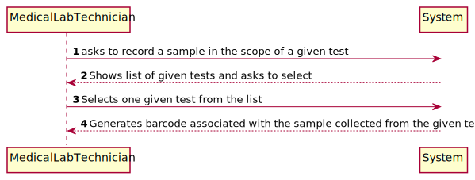
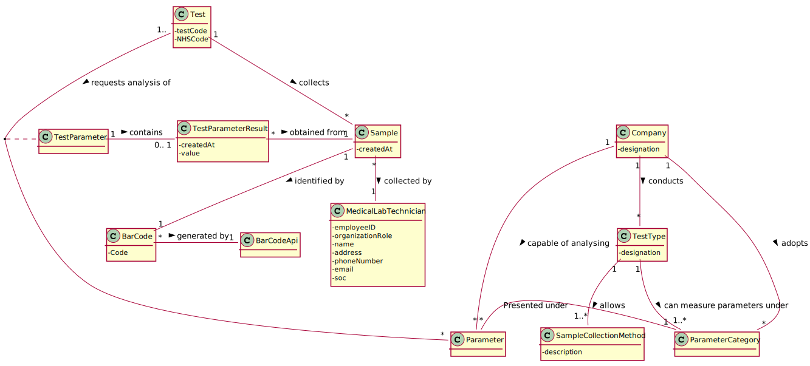
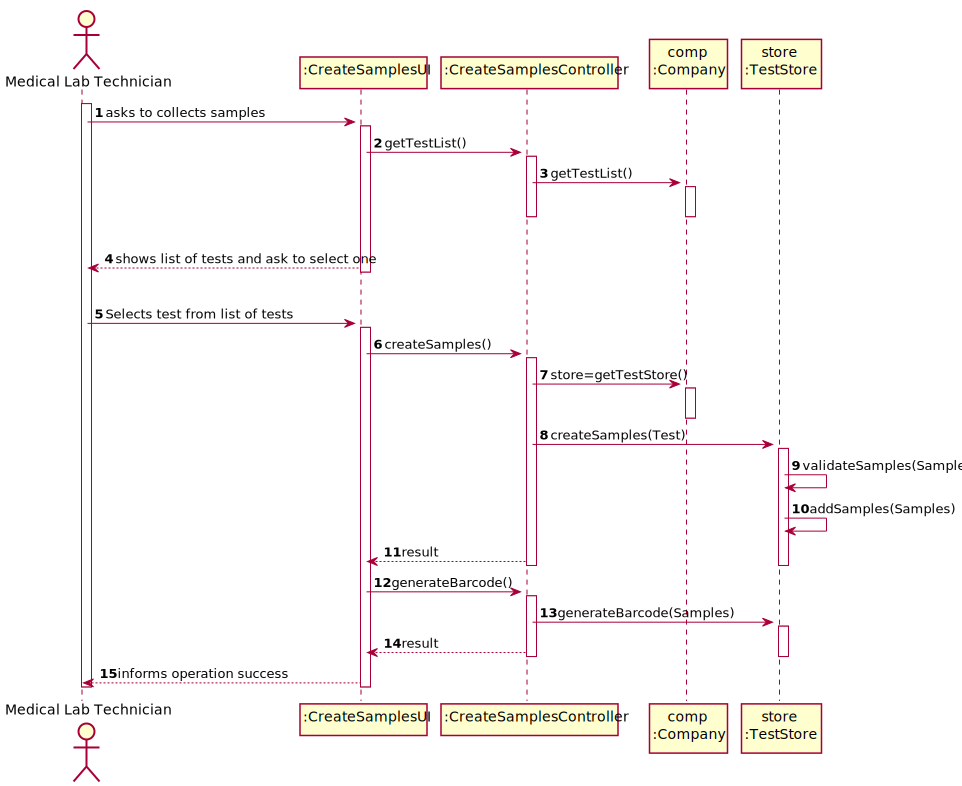
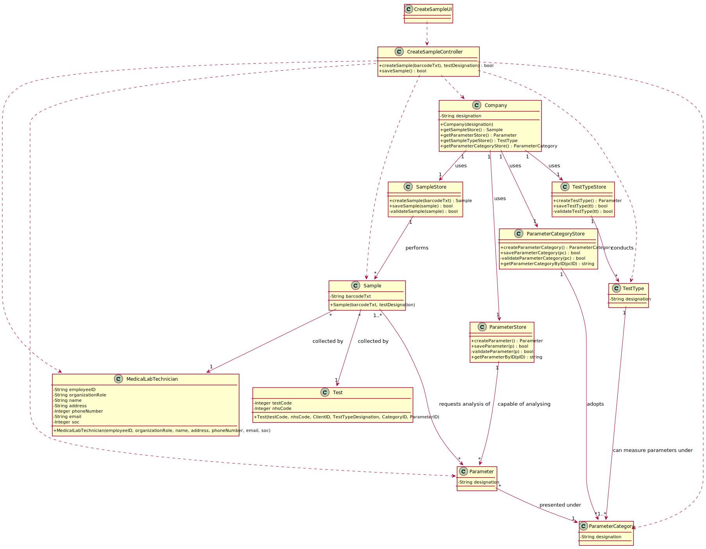

# US 005 - Record the collected samples

## 1. Requirements Engineering

### 1.1. User Story Description

As a medical lab technician, I want to record the samples collected in the scope of a given test.

### 1.2. Customer Specifications and Clarifications 

**From the specifications document:**

>(none)

**From the client clarifications:**

> **Question:** What kind of attributes should a sample have?
>  
> **Answer:** Each sample is associated with a test. A sample has only one attribute, a barcode number (UPC) that is a sequential number and is automatically generated by the system. Each sample has a unique barcode number.

-

> **Question:** What will the API be used for?
>  
> **Answer:** The API will be used to generate/print barcodes.

### 1.3. Acceptance Criteria

* **AC1:**The system should support several barcode APIs. The API to use is defined by configuration.

### 1.4. Found out Dependencies

* Recording collected samples in the scope of a given test depends on the US4, since there needs to exist a given test for its samples to be collected and recorded

### 1.5 Input and Output Data

**Input Data:**

* Typed data:
	* ------
	
* Selected data:
	* tests from the list of tests.

**Output Data:**

* List of tests
* Generated Barcode(s)
* Information regarding the success of the action.

### 1.6. System Sequence Diagram (SSD)

**Alternative 1**

<!---
**Alternative 2**

--->
**Other alternatives might exist.**

### 1.7 Other Relevant Remarks

n/a

## 2. OO Analysis

### 2.1. Relevant Domain Model Excerpt 

### 2.2. Other Remarks

n/a

## 3. Design - User Story Realization 

### 3.1. Rationale

**SSD - Alternative 1 is adopted.**

| Interaction ID | Question: Which class is responsible for... | Answer  | Justification (with patterns)  |
|:-------------  |:--------------------- |:------------|:---------------------------- |
| Step 1  		 |	... interacting with the actor? | RecordSamplesUI   |  Pure Fabrication: there is no reason to assign this responsibility to any existing class in the Domain Model.           |
| 			  		 |	... coordinating the US? | RecordSamplesController | Controller                             |
| 			  		 |	... instantiating a new sample | Medical Lab Technician | Creator: R1   |
| 			  		 | ... knowing the user using the system?  | UserSession  | IE: cf. A&A component documentation.  |
| Step 2  		 |							 |             |                              |
| Step 3  		 |	...saving the inputted data? | Medical Lab Technician  | IE: object created in step 1 has its own data.  |
| Step 4  		 |	...knowing the tests to show? | Receptionist | IE: tests are added to the system by the receptionist. |
| Step 5  		 |	... saving the selected sample | --- | IE: object created in step 1 is classified in one or more samples.  |
| Step 6  		 |							 |             |                              |              
| Step 7  		 |	... validating all data (local validation)? | Company | IE: owns its data.| 
| 			  		 |	... validating all data (global validation)? | Company | IE: knows all its samples.| 
| 			  		 |	... saving the created samples? | Company | IE: owns all its samples.| 
| Step 8  		 |	... informing operation success?| RecordSamplesUI  | IE: is responsible for user interactions.  | 

### Systematization ##

According to the taken rationale, the conceptual classes promoted to software classes are: 

 * Company
 * Medical Lab Technician
 * Receptionist
 * Sample

Other software classes (i.e. Pure Fabrication) identified: 

 * RecordSamplesUI  
 * RecordSamplesController

## 3.2. Sequence Diagram (SD)

**Alternative 1**

**Alternative 2**

## 3.3. Class Diagram (CD)

**From alternative 1**

# 4. Tests 

**Test 1:** Check that it is not possible to create an instance of the CAL class with null values - AC1. 

    @Test(expected = IllegalArgumentException.class)
    public void ensureReferenceMeetsAC1() {
           Sample instance = new Sample(null, null);
        }

# 5. Construction (Implementation)

## Class CreateSampleController 

   
    public class CreateSampleController {
    private Company company;
    private Sample sample;
    public CreateSampleController()
    {
        this(App.getInstance().getCompany());
    }

    public CreateSampleController(Company company)
    {
        checkUserAuth();
        this.company = company;
        this.sample = null;
    }

    private void checkUserAuth() {
        boolean loggedInWithRole = App.getInstance().getCurrentUserSession().isLoggedInWithRole(Constants.ROLE_MEDICALLABTECHNICIAN);
        if (!loggedInWithRole)
            throw new IllegalStateException("User has no permission to do this operation.");
    }

    public boolean createSample(String barcode, String testDesignation)
    {
        this.sample = this.company.createSample(barcode, testDesignation);
        return this.company.validateSample(sample);
    }

    public boolean saveSample()
    {
        return this.company.saveSample(sample);
    }

    public ArrayList<Parameter> getInstanceOfParameterCategory(String code) throws Exception {
        return this.company.getInstanceOfParameterCategory(code);
    }
     public ArrayList<Test> getTestList() {
      return this.company.getTestList();
      }
    public ArrayList<Test> getInstanceOfState(String state) throws Exception {
        return this.company.getInstanceOfState(state);
    }
    }
 

## Class Company

package app.domain.model;

import auth.AuthFacade;
import org.apache.commons.lang3.StringUtils;

import java.util.ArrayList;
import java.util.Calendar;
import java.util.Date;
import java.util.List;

import static org.apache.commons.lang3.CharSetUtils.count;

public class Company {

    private final String designation;
    private final AuthFacade authFacade;

    private Sample sample;
    private List<Sample> sampleList;

    public Company(String designation)
    {
        if (StringUtils.isBlank(designation))
            throw new IllegalArgumentException("Designation cannot be blank.");

        this.designation = designation;
        this.authFacade = new AuthFacade();

    
        this.sampleList = new ArrayList<>();
       
    }

    public String getDesignation() {
        return designation;
    }

    public AuthFacade getAuthFacade() {
        return authFacade;
    }

    public Test createTest(long testCode, long nhsCode, String testDesignation, long ccNumber, String testType, ArrayList<String> parameterCategoryList,
                           ArrayList<String> parameterList, String state, Date date)
    {
        return new Test(testCode, nhsCode, testDesignation, ccNumber, testType, parameterCategoryList, parameterList, state, date);
    }

    public Test testingTest(long testCode, long nhsCode, String testDesignation, long ccNumber, String testType, ArrayList<String> parameterCategoryList,
                           ArrayList<String> parameterList, String state, Date date)
    {
        return new Test(testCode, nhsCode, testDesignation, ccNumber, testType, parameterCategoryList, parameterList, state, date);
    }
    /**
     * @param test test
     * @return test
     */
    public boolean saveTest(Test test) {
        if (!validateTest(test))
            return false;
        return this.testList.add(test);
    }

    /**
     * @param test test
     * @return test
     */
    public boolean validateTest(Test test) {
        if (test == null)
            return false;
        return ! this.testList.contains(test);
    }

    public long getTestCode() {
        return this.testCode;
    }

    public ArrayList<Test> getTestList() {
        return this.testList;
    }

    public ArrayList<Test> getInstanceOfState(String state) throws Exception {
        Test testToSend = null;
        this.tempTestList = new ArrayList<>();
        for (Test t : getTestList()) {
            if (t.getState().equals(state)) {
                testToSend = t;
                tempTestList.add(testToSend);
            }
        }
        return tempTestList;
    }

    public Sample testingSample(String barcodeText, String testDesignation)
    {
        return new Sample(barcodeText, testDesignation);
    }

    public Sample createSample(String barcodeText, String testDesignation)
    {
        return  new Sample(barcodeText,testDesignation);
    }

    public boolean saveSample(Sample sample) {
        if (!validateSample(sample))
            return false;
        return this.sampleList.add(sample);
    }

    public boolean validateSample(Sample sample) {
        if (sample == null)
            return false;
        return ! this.sampleList.contains(sample);
    }
    }

## Class Sample
package app.domain.model;

import net.sourceforge.barbecue.Barcode;

import java.util.ArrayList;
import java.util.Calendar;
import java.util.Date;

    public class Sample {

    private static String generated_mode_to_be_used = "Barbecue";
    private String barcodeText;
    private String testDesignation;

    /**
     * Barcode of the corresponding sample
     */
    private Barcode barcode;

    public Sample(String barcodeText, String testDesignation) {
        checkTestDesignationNull(testDesignation);
        checkbarcodeTextNull(barcodeText);
        this.testDesignation = testDesignation;
        this.barcodeText = barcodeText;

    }

    /**
     * Barcode
     *
     * @return barcode
     */
    public Barcode getBarcode() {
        return barcode;
    }

    /**
     * @param testDesignation test if testDesignation is null
     */
    private void checkTestDesignationNull(String testDesignation)
    {
        if (testDesignation.length() == 0)
            throw new IllegalArgumentException("Test Designation cannot be blank.");
    }
    /**
     * @param barcodeText test if testDesignation is null
     */
    private void checkbarcodeTextNull(String barcodeText)
    {
        if (barcodeText.length() == 0)
            throw new IllegalArgumentException("Barcode number cannot be blank.");
    }
    /**
 * Date of the sample
 * @return date
   public Date getDate() {
   return date;
   }
   */
   }

# 6. Integration and Demo 

* New item was added to the medical lab techinician menu.

# 7. Observations

