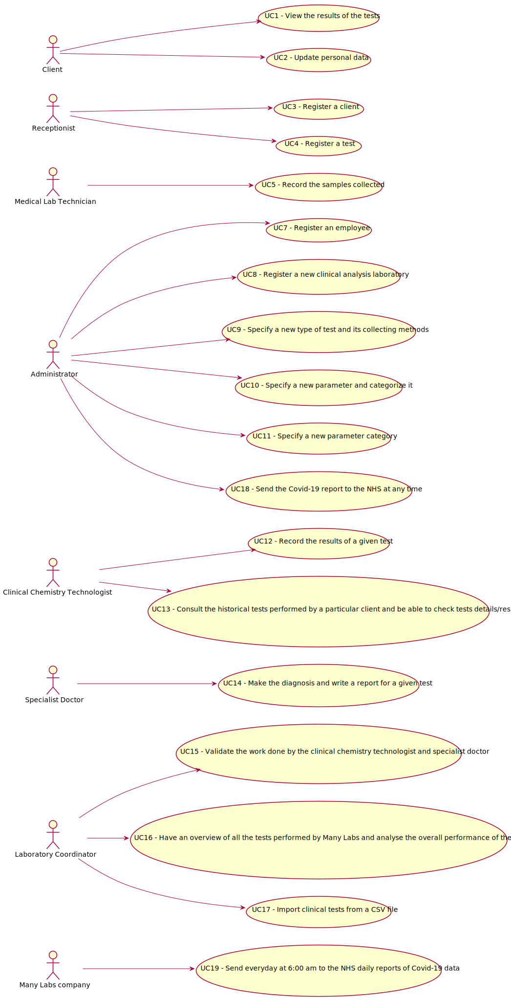

# Use Case Diagram (UCD)

# Use Cases / User Stories
| UC/US  | Description |                   
|:----|:------------------------------------------------------------------------|
| US1 | [ViewTheResusltsOfTheTests](US1.md)|
| US2 | [UpdatePersonalData](US2.md)|
| US3 | [RegisterAClient](US3.md)|
| US4 | [RegisterATest](US4.md)|
| US5 | [RecordTheSamplesCollected](US5.md)|
| US7 | [RegisterAnEmployee](US7.md)|
| US8 | [RegisterANewClinicalAnalysisLaboratory](US8.md)|
| US9 | [SpecifyANewTypeOfTestAndItsCollectingMethods](US9.md)|
| US10 | [SpecifyANewParameterAndCategorizeIt](US10.md)|
| US11 | [SpecifyANewParameterCategory](US11.md)|
| US12 | [RecordTheResultsOfAGivenTest](US12.md)|
| US13 | [ConsultTheHistoricalTestsPerformedByAParticularClientAndBeAbleToCheckTestsDetails/Results](US13.md)|
| US14 | [MakeTheDiagnosisAndWriteAReportForAGivenTest](US14.md)|
| US15 | [ValidateTheWorkDoneByTheClinicalChemistryTechnologistAndSpecialistDoctor](US15.md)|
| US16 | [HaveAnOverviewOfAllTheTestsPerformedByManyLabsAndAnalyseTheOverallPerformanceOfTheCompany](US16.md)|
| US17 | [ImportClinicalTestsFromACSVFile](US17.md)|
| US18 | [SendTheCovid-19ReportToTheNHSAtAnyTime](US18.md)|
| US19 | [SendEverydayAt6:00amToTheNHSDailyReportsOfCovid-19Data](US19.md)|
