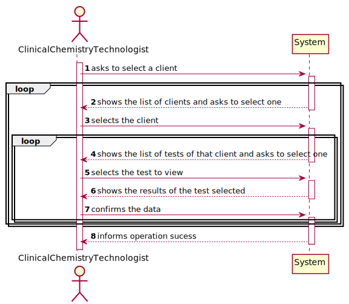

# US 013 - To consult the historical tests

## 1. Requirements Engineering

### 1.1. User Story Description

As a clinical chemistry technologist, I intend to consult the historical tests performed by a particular client and to be able to check tests details/results.

### 1.2. Customer Specifications and Clarifications 

**From the specifications document:**

>	At the same time the results are also available in the central application where the medical lab technicians who collect the samples, the clinical chemistry technologist, the specialist doctor, and the laboratory coordinator can check them. To facilitate the access to the results, the application must allow ordering the clients by TIF and by name. The ordering algorithm to be used by the application must be defined through a configuration file. It is intended that the choice of the ordering algorithm is based on the algorithm complexity (mainly the execution time). Therefore, at least two sorting algorithms should be evaluated and documented in the application user manual (in the annexes) that must be delivered with the application.

**From the client clarifications:**

> **Question:** Should we show every client already registered when we show the clients' list to the clinical chemistry technologist or should we only show the clients' with a test or more already assigned?
>
> **Answer:** The system should show only clients that have tests already validated by the lab coordinator.

-

> **Question:** Should we consider this US valid for these 3 actors as originally stated, or only for the lab coordinator as stated now?
>  
> **Answer:** Developing an application, like the one we are developing during the Integrative Project, is dynamic process and the teams should be able to react to change. Moreover, the latest client requests/requirements are those that should be considered. Typically, the client updates the requirements throughout the project development.
Please consider the requirements introduced at the beginning of Sprint D.

-

> **Question:**: The client's tests, that we have to show on this US, need to have been validated by the lab coordinator or is it enough if they just have results and we can show them before being validated by the lab coordinator?
>  
> **Answer:** The tests to be presented in US13 are tests that have already been validated by the lab coordinator.

-

> **Question:**: From the user story description "As a clinical chemistry technologist, I intend to consult the historical tests performed by a particular client and to be able to check tests details/results". What do you mean by "check tests details/results" ?
>  
> **Answer:** The clinical chemistry technologist should be able to check the historical tests performed by a particular client and see the results obtained in each test. For a given client (that was selected by the clinical chemistry technologist) the application should show all tests performed by the client and, for each parameter, the application should show the parameter value and the parameter reference values. The clinical chemistry technologist should not have access to the report made by the specialist doctor.

### 1.3. Acceptance Criteria

* **AC1:** The application must allow ordering the clients by TIN and by name to help the clinical chemistry technologist choose the target client. The ordering algorithm to be used by the application must be defined through a configuration file. At least two sorting algorithms should be available.

### 1.4. Found out Dependencies

* There is a dependency to "US3 Register a client" since at least a client must be registered to consult the historical tests performed by a particular client.

### 1.5 Input and Output Data

**Input Data:**

* Typed data:

	
* Selected data:
	* Selecting client
    * Selecting test(s)

**Output Data:**

* List of existing clients
* List of existing tests
* (In)Success of the operation

### 1.6. System Sequence Diagram (SSD)

**Alternative 1**

### 1.7 Other Relevant Remarks

n/a

## 2. OO Analysis

### 2.1. Relevant Domain Model Excerpt 

### 2.2. Other Remarks

n/a

## 3. Design - User Story Realization 

### 3.1. Rationale

**SSD - Alternative 1 is adopted.**

| Interaction ID | Question: Which class is responsible for... | Answer  | Justification (with patterns)  |
|:-------------  |:--------------------- |:------------|:---------------------------- |
| Step 1  		 |	... interacting with the actor? | ConsultTestsUI   |  Pure Fabrication: there is no reason to assign this responsibility to any existing class in the Domain Model.           |
| 			  		 |	... coordinating the US? | ConsultTestsController | Controller                             |		  	
| Step 2  		 |	...knowing the clients to show? | ClientStore | IE: Clients are defined by the ClientStore. |
| Step 3  		 |	... saving the selected client? | ClinicalChemistryTechnologist | IE: object created in step 1 is classified in one ???.  |
| Step 4 		 |	...knowing the tests to show? | TestStore | IE: Categories are defined by the Administrator. |
| Step 5  		 |	... saving the selected test? | ClinicalChemistryTechnologist | IE: object created in step 1 is classified in ???.  |
| Step 6  		 |							 |             |                              |              
| Step 7  		 |	... validating all data (local validation)? | ClinicalChemistryTechnologist | IE: owns its data.| 
| 			  		 |	... validating all data (global validation)? | Company | IE: knows all its Clients and Tests.| 
| Step 8  		 |	... informing operation success?| CreateTestUI  | IE: is responsible for user interactions.  | 

### Systematization ##

According to the taken rationale, the conceptual classes promoted to software classes are: 

 * Company
 * Clinical Chemistry Technologist

Other software classes (i.e. Pure Fabrication) identified: 

 * ConsultTestsUI  
 * ConsultTestsController
 * ClientStore
 * TestStore

## 3.2. Sequence Diagram (SD)

**Alternative 1**

## 3.3. Class Diagram (CD)

**From alternative 1**

# 4. Tests 
	
**Test 1:** Check that it is not possible to create an instance of the Test class with a testCode being null. 

    @Test(expected = IllegalArgumentException.class)
    public void ensureTestCodeNotNull()
    {
        Company company = new Company("ManyLabs");

        long testCode = Long.parseLong(null);

        String nhsCode = "123456789012";

        String textDesignation = "Designation";

        long ccNumber = 1234567890123456L;

        String testType = "Blood";

        ArrayList<String> testParameterCategoryList = new ArrayList<>();
        ArrayList<String> testParameterList = new ArrayList<>();

        testParameterCategoryList.add("CategoryName");
        testParameterList.add("ParName");

        String state = "Valid";

        Calendar calendar = Calendar.getInstance();

        Date date = calendar.getTime();

        company.testingTest(testCode, nhsCode, textDesignation, ccNumber, testType, testParameterCategoryList, testParameterList, state, date);
    }
**Test 2:** Check that it is not possible to create an instance of the Test class with a testCode not containing 12 digits. 

    @Test(expected = IllegalArgumentException.class)
    public void ensureTestCodeNotBiggerThan12Digits()
    {
        Company company = new Company("ManyLabs");

        long testCode = 1234567890123L;

        String nhsCode = "123456789012";

        String textDesignation = "Designation";

        long ccNumber = 1234567890123456L;

        String testType = "Blood";

        ArrayList<String> testParameterCategoryList = new ArrayList<>();
        ArrayList<String> testParameterList = new ArrayList<>();

        testParameterCategoryList.add("CategoryName");
        testParameterList.add("ParName");

        String state = "Valid";

        Calendar calendar = Calendar.getInstance();

        Date date = calendar.getTime();

        company.testingTest(testCode, nhsCode, textDesignation, ccNumber, testType, testParameterCategoryList, testParameterList, state, date);
    }
    
# 5. Construction (Implementation)

## Class ConsultHistoricalTestsController 

    public class ConsultHistoricalTestsController
    {
    /**
     * Company
     */
    private final Company company;

    Calendar calendar = Calendar.getInstance();

    public ConsultHistoricalTestsController(){
        this(App.getInstance().getCompany());
    }

    /**
     * @param company company
     */
    public ConsultHistoricalTestsController(Company company){
        checkUserAuth();
        this.company = company;
    }

    /**
     * Checks if the user logged in has the clinical chemistry technologist role
     */
    private void checkUserAuth(){
        boolean loggedInWithRole = App.getInstance().getCurrentUserSession().isLoggedInWithRole(Constants.ROLE_CLINICALCHEMISTRYTECHNOLOGIST);
        if (!loggedInWithRole)
            throw new IllegalStateException("User has no permission to do this operation.");
    }

    /**
     * Gets the Test List
     * @return test list of test
     */
    public ArrayList<Test> getTestList() {
        return this.company.getTestList();
    }

    /**
     * Gets the Client List
     * @return client list of clients
     */
    public ArrayList<Client> getClientList() {
        return this.company.getClientList();
    }

    /**
     * Gets the test code
     * @return test code of test
     */
    public long getTestCode()
    {
        return this.company.getTestCode();
    }

    /**
     * Gets the current date
     * @return date of test
     */
    public Date getDate()
    {
        return calendar.getTime();
    }
}

## Class ConsultHistoricalTestsUI

    public class ConsultHistoricalTestsUI implements Runnable{

    /**
     * Controller of test
     */
    private final ConsultHistoricalTestsController ctrl;
    /**
     * list of tests
     */
    public ArrayList<Test> testList;
    /**
     * temporary list of tests
     */
    public ArrayList<Test> tempTestList;
    /**
     * list of clients
     */
    public ArrayList<Client> clientList;

    public ConsultHistoricalTestsUI(){
        this.ctrl = new ConsultHistoricalTestsController();
        this.testList = new ArrayList<>();
        this.tempTestList = new ArrayList<>();
        this.clientList = new ArrayList<>();
    }

    @Override
    public void run() {

        System.out.println("\n Selecting a Client: \n");

        this.clientList = this.ctrl.getClientList();
        this.testList = this.ctrl.getTestList();

        if (testList.size() == 0 || clientList.size() == 0)
        {
            System.out.println("\nError: There are no tests/clients created.");
        }

        try
        {
            viewData();
        }
        catch(Exception ex)
        {
            System.out.println("Ocorreu um erro: operação cancelada. \n" + ex.getMessage());
        }
    }

    private void viewData() {
        int option2 = 0;
        String optionSelected = "4";
        do
        {
            if (optionSelected != null && optionSelected.equals("4")) {
                clientList = ctrl.getClientList();
                System.out.println("" + clientList);
            }

            optionSelected = Utils.readLineFromConsole("1 - Order by Name \n 2 - Order by TIN \n 3 - Select a client \n Select an option: ");

            if (optionSelected != null)
            {
                switch (optionSelected)
                {
                    case "1":
                        clientList = ctrl.bubleSortName(clientList);
                        System.out.println(clientList);
                        break;
                    case "2":
                        clientList = ctrl.insertionSortName(clientList);
                        System.out.println(clientList);
                        break;
                    case "3":
                        clientList = ctrl.getClientList();
                        System.out.println(clientList);

                        String clientSelected = Utils.readLineFromConsole("Select the Client you want to view the tests results of (Name):");

                        String clientName;
                        clientName = ctrl.getInstanceOfClientName(clientSelected);

                        int cont = 0;
                        if (clientSelected != null && clientSelected.equals(clientName)) {
                            cont = 1;
                        }

                        while (cont == 0) {
                            clientSelected = Utils.readLineFromConsole("Select a valid Client that you want to view the tests results of (Name):");
                            clientName = ctrl.getInstanceOfClientName(clientSelected);
                            if (clientSelected != null && clientSelected.equals(clientName)) {
                                cont = 1;
                            }
                        }

                        long ccNumber = ctrl.getInstanceOfTestccNumber(clientSelected);
                        int option1 = 0;
                        do {
                            tempTestList = ctrl.getInstanceOfTest(ccNumber);

                            Collections.sort(tempTestList);

                            ArrayList<String> testDesignationList1 = ctrl.getInstanceOfTestDesignation(ccNumber);

                            ArrayList<Date> testDateList = new ArrayList<>();
                            Date testDate;

                            for (String s : testDesignationList1) {
                                testDate = ctrl.getInstanceOfTestDate(s);
                                testDateList.add(testDate);
                            }

                            Collections.sort(testDateList);

                            ArrayList<String> testDesignationList = new ArrayList<>();
                            String testDesignation;

                            for (Date d : testDateList) {
                                testDesignation = ctrl.getInstanceOfTestDesignationByDate(d);
                                testDesignationList.add(testDesignation);
                            }

                            for (int i = 0; i < testDesignationList.size(); i++) {
                                System.out.println(testDesignationList.get(i) + ", " + testDateList.get(i));
                            }

                            String testSelected = Utils.readLineFromConsole("Select the Test you want to view the results of (testDesignation):");

                            cont = 0;
                            for (String s : testDesignationList) {
                                if (testSelected != null && testSelected.equals(s)) {
                                    cont++;
                                }
                            }

                            while (cont == 0) {
                                testSelected = Utils.readLineFromConsole("Select a valid Test that you want to view the results of (testDesignation):");
                                for (String s : testDesignationList) {
                                    if (testSelected != null && testSelected.equals(s)) {
                                        cont++;
                                    }
                                }
                            }

                            System.out.println(ctrl.getInstanceOfTest2(testSelected));

                            if (!Utils.confirm("Do you want to view more Tests? (Y/N)"))
                                option1 = -1;
                        }
                        while (option1 != -1);

                        if (!Utils.confirm("Do you want to select more clients? (Y/N)"))
                        {
                            option2 = -1;
                        }
                        else
                        {
                            optionSelected = "4";
                        }
                        break;
                    default:
                        throw new IllegalStateException("Unexpected value: " + optionSelected);
                }
            }
        }
        while (option2 != -1);
    }
}

## Class Company

    private String designation;
    private AuthFacade authFacade;
    private List<Test> TestList;
    private List<Test> ClientList;
    
    public Company(String designation)
    {
        if (StringUtils.isBlank(designation))
            throw new IllegalArgumentException("Designation cannot be blank.");

        this.designation = designation;
        this.authFacade = new AuthFacade();
        this.TestList = new ArrayList<>();
        this.ClientList = new ArrayList<>();
    }

    public Test createTest(long testCode, long nhsCode, String textDesignation, long ccNumber, String testType, ArrayList<String> testParameterCategoryList, ArrayList<String> testParameterList, String state, Date date)
    {
        return new Test(testCode, nhsCode, textDesignation, ccNumber, testType, testParameterCategoryList, testParameterList, state, date);
    }

    public boolean saveTest(Test test) {
        if (!validateTest(test))
            return false;
        return this.TestList.add(test);
    }

    public boolean validateTest(Test test) {
        if (test == null)
            return false;
        return ! this.TestList.contains(test);
    }
    
    public Client createClient(String Name, long CitizenCardNumber, long NHSNumber, Date BirthDate, String Sex, long TIN, long PhoneNumber, String Email) 
    { 
        return new Client(Name, CitizenCardNumber, NHSNumber, BirthDate, Sex, TIN, PhoneNumber, Email); 
    }

    public boolean validateClient(Client client) {
        if (client == null)
            return false;
        return !this.clientList.contains(client);
    }

    public boolean saveClient(Client client) {
        if (!validateClient(client))
            return false;
        return this.clientList.add(client);
    }

# 6. Integration and Demo 

* A new option on the Clinical Chemistry Technologist menu options was added.

# 7. Observations

n/a

