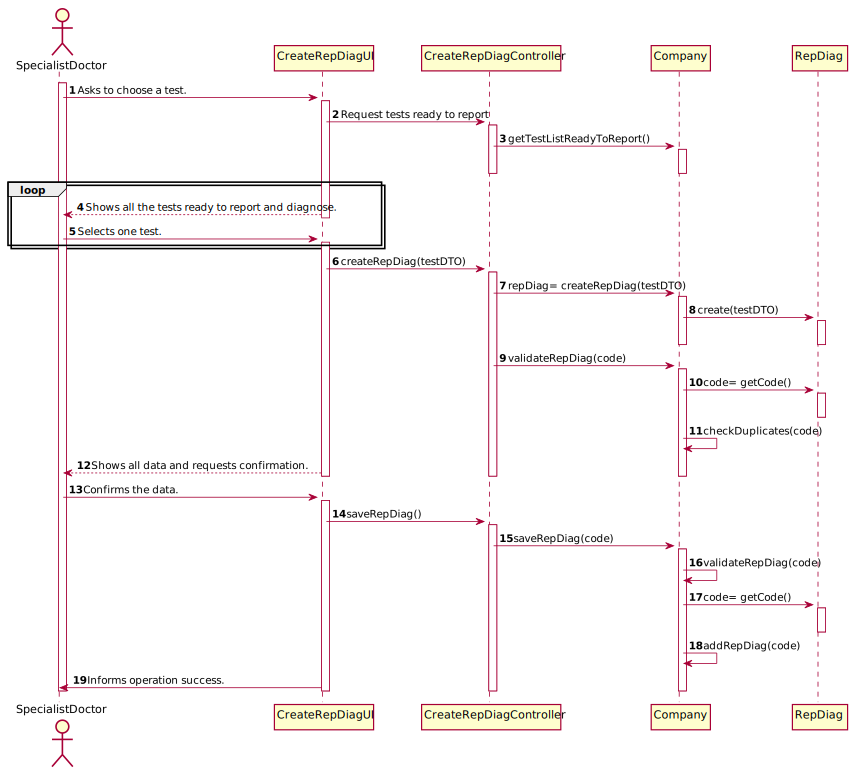

# US 014 - Make diagnosis and write a report for tests.

## 1. Requirements Engineering

### 1.1. User Story Description

As a specialist doctor, I intend to make the diagnosis and write a report for a given test.

### 1.2. Customer Specifications and Clarifications 

**From the Specifications Document:**

>   The results of all chemical analyses are analysed by a specialist doctor who makes a diagnosis and writes a report that afterwards will be delivered to the client.

>   To facilitate and simplify the validation work performed by the specialist doctor, the application uses an external module that is responsible for doing an automatic validation using test reference values.

>   The specialist doctor completes the diagnosis, after that the results of the clinical analyses and the report become available in the system.

>   Each test is characterized by an internal code, an NHS code, the type of test and a description including the date and time of the diagnosis made by the specialist doctor.

>   The Client must access the application to view those results.

**From the client clarifications:**

>   **Question:** Regarding the tests that the Specialist Doctor can write a report about. Should the SD chose from a list of tests? and Should him only receive a list of test that have completed all the previous steps?
>
>   **Answer:** The system shows all tests ready (that have completed all the previous steps) to make the diagnosys and the Specialist Doctor selects one test. Then, the Specialist Doctor writes the report for the selected test. 

-

>   **Question:** Is there a limit of characters for the report and the diagnosis that will be made by the Specialist Doctor?
>
>   **Answer:** Yes, at most 400 words.

-

>   **Question:** Can the Specialist Doctor edit a report once it has already been written? If yes, in what occasion should he be able to edit? Can he edit after the Laboratory Coordinator has already approved the report?
>
>   **Answer:** No. No.

-

>   **Question:** Once the specialist doctor decides to write the report for a given test, should the results of the chemical analysis and the reference values be presented on the screen? If not, how should the specialist doctor access the data related to the diagnosis he needs to make?
>
>   **Answer:** After selecting a test (to make the diagnosis/report) the results of the chemical analysis and the reference values should be presented on the screen. Then the Specialist Doctor should write the report.

-

>   **Question:** While in the "Make a diagnosis and write a report" option of the main menu, should the specialist doctor be able to make a diagnosis and write a report for more than one test? Or does he need to exit and enter the "Make a diagnosis and write a report" option every time he wants to make a new diagnosis and write a new report?
>
>   **Answer:** After writing a report the SD can choose to write other reports without leaving the use case.

-

>   **Question:** What kind of validation should the external module do? Should it show the test reference values next to the test parameter results for the Specialist Doctor [and Clinical chemistry technologist] to validate it by himself? 
>
>   **Answer:** The system should "show the test reference values next to the test parameter results".

### 1.3. Acceptance Criteria

* **AC1:** The report should have less than 400 words. 
* **AC2:** The specialist doctor selects the test to write the report and diagnose
* **AC3:** The report contains the diagnosis.
* **AC4:** The date and time of the diagnosis made by the specialist doctor must be saved.
* **AC5:** The Specialist Doctor must be able to do more than one report/diagnose withouth leaving the application.
* **AC6:** The system must show the test reference values next to the test parameter results.
* **AC7:** Client's info must be shown to the Specialist Doctor.

### 1.4. Found out Dependencies

There is a dependency to US015 (Laboratory Coordinator validates the Specialist Doctor work), to US012 (Clinical Chemistry Technologist records the result of one test) and to US004 (Registering a test).

### 1.5 Input and Output Data

**Input Data:**

* Diagnosis
* Report

**Output Data:**

* Test result values and reference values

### 1.6. System Sequence Diagram (SSD)

### 1.7 Other Relevant Remarks

*Use this section to capture other relevant information that is related with this US such as (i) special requirements ; (ii) data and/or technology variations; (iii) how often this US is held.* 

## 2. OO Analysis

### 2.1. Relevant Domain Model Excerpt 

### 2.2. Other Remarks

*Use this section to capture some aditional notes/remarks that must be taken into consideration into the design activity. In some case, it might be usefull to add other analysis artifacts (e.g. activity or state diagrams).* 

## 3. Design - User Story Realization 

### 3.1. Rationale

**The rationale grounds on the SSD interactions and the identified input/output data.**

| Interaction ID | Question: Which class is responsible for... | Answer  | Justification (with patterns)  |
|:-------------  |:--------------------- |:------------|:---------------------------- |
| Step 1  		 | ... interacting with the actor? | CreateRepDiagUI | Pure Fabrication: there is no reason to assign this responsibility to any existing class in the Domain Model. |
|   		     | ... coordinating the US?       |   CreateRepDiagController |   Controller  |
|                | ... instantiating a new Report and Diagnose? | Specialist Doctor  |   Creator: R1      |
|                | ... knowing the user using the system? | UserSession  |  IE: cf. A&A component documentation.           |
| Step 2  		 | ... knowing the tests ready to diagnose and report?   |  Company | Tests are saved by Company            |   
| Step 3  		 | ... saving the test?   |  Specialist Doctor  |  IE: object created in step 1 has its own data. |
| Step 4  		 | ... knowing all information about the test?  | Company | Company saves the information. |
| Step 5  		 | ... saving the diagnose and report?  | Company  |  IE: owns all its tests. |
| Step 6  		 |							 |             |                              |     
| Step 7  		 | ... validating all data (local validation)? | ReportDiagnose | IE: owns its data.| 
| 			     | ... validating all data (global validation)? | Company | IE: knows all its tests.| 
| 			     | ... saving the created Report and Diagnose? | Company | IE: owns all its tests.| 
| Step 8  		 | ... informing operation success? | CreateRepDiagUI  | IE: is responsible for user interactions.  | 
             

### Systematization ##

According to the taken rationale, the conceptual classes promoted to software classes are: 

 * Company
 * Specialist Doctor
 * RepDiag

Other software classes (i.e. Pure Fabrication) identified: 

 * CreateRepDiagUI
 * CreateRepDiagController

## 3.2. Sequence Diagram (SD)

## 3.3. Class Diagram (CD)

# 4. Tests 
*In this section, it is suggested to systematize how the tests were designed to allow a correct measurement of requirements fulfilling.* 

**_DO NOT COPY ALL DEVELOPED TESTS HERE_**

**Test 1:** Check that it is not possible to create an instance of the Example class with null values. 

	@Test(expected = IllegalArgumentException.class)
		public void ensureNullIsNotAllowed() {
		Exemplo instance = new Exemplo(null, null);
	}

*It is also recommended to organize this content by subsections.* 

# 5. Construction (Implementation)

## Class SpecialistDoctor UI

    public class SpecialistDoctorUI implements Runnable{
    public SpecialistDoctorUI()
    {
    }

    public void run()
    {
        List<MenuItem> options = new ArrayList<MenuItem>();
        options.add(new MenuItem("Make diagnosis and write a report for tests.", new CreateRepDiagUI()));

        int option = 0;
        do
        {
            option = Utils.showAndSelectIndex(options, "\n\nSpecialist Doctor Menu:");

            if ( (option >= 0) && (option < options.size()))
            {
                options.get(option).run();
            }
        }
        while (option != -1 );
    }
    }
    
    
## Class CreateRepDiagUI

    public class CreateRepDiagUI implements Runnable {

    private CreateRepDiagController ctrl;

    public CreateRepDiagUI() {
    }

    @Override
    public String toString() {
        return "CreateRepDiagUI{" +
                "ctrl=" + ctrl +
                '}';
    }

    @Override
    public void run() {
        ctrl = new CreateRepDiagController();
        System.out.println("\n Diagnosing and writing a report: \n");
        System.out.println("Lista: ");
        ArrayList<Test> allTests = ctrl.getTestList();
        ArrayList<Test> invalidTests = new ArrayList<>();
        // System.out.println(allTests.toString());
        int i;
        for (i = 0; i < allTests.size(); i++) {
            if (allTests.get(i).state.equals("Invalid")) {
                invalidTests.add(allTests.get(i));
            }
        }
        System.out.println(invalidTests);

        long testCode = Utils.readIntegerFromConsole("Select one of the tests by testCode");
        try {
            System.out.println(ctrl.getInstanceOfTestCode(testCode));
        } catch (Exception e) {
            e.printStackTrace();
        }

        String report = Utils.readLineFromConsole("Write here the report (max. 400 words):");

        this.ctrl.createRepDiag(report);
        this.ctrl.saveRepDiag(report);

        try {
            FileWriter ReportinFile = new FileWriter("Report"+testCode+".txt");
            ReportinFile.write(report);
            ReportinFile.close();

            System.out.println("Successfully saved the Report.");
        } catch (IOException e) {
            System.out.println("An error occurred.");
            e.printStackTrace();
        }
    }
    }
    
    
    
    
## Class CreateRepDiagController

    public class CreateRepDiagController {

    private Company company;
    private String report;
    private ArrayList<Test> testList;
    private Object rep;

    public CreateRepDiagController()
    {
        this(App.getInstance().getCompany());
    }

    public CreateRepDiagController(Company company)
    {
        checkUserAuth();
        this.company = company;
        this.testList = company.getTestList();
    }

    private void checkUserAuth() {
        boolean loggedInWithRole = App.getInstance().getCurrentUserSession().isLoggedInWithRole(Constants.ROLE_SPECIALISTDOCTOR);
        if (!loggedInWithRole)
            throw new IllegalStateException("User has no permission to do this operation.");
    }

    public ArrayList<Test> getTestList() {
        return this.company.getTestList();
    }

    public ArrayList<Test> getInstanceOfTestCode(long testCode) throws Exception {
        return this.company.getInstanceOfTestCode(testCode);
    }

    public boolean createRepDiag(String report) {
        this.rep = this.company.createRepDiag(report);
        return this.company.validateRepDiag(report);
    }

    public boolean saveRepDiag(String report)
    {
        return this.company.saveRepDiag(this.report);
    }
    }

# 6. Integration and Demo 

Specialist Doctor Menu was added to the application.

# 7. Observations

*In this section, it is suggested to present a critical perspective on the developed work, pointing, for example, to other alternatives and or future related work.*

