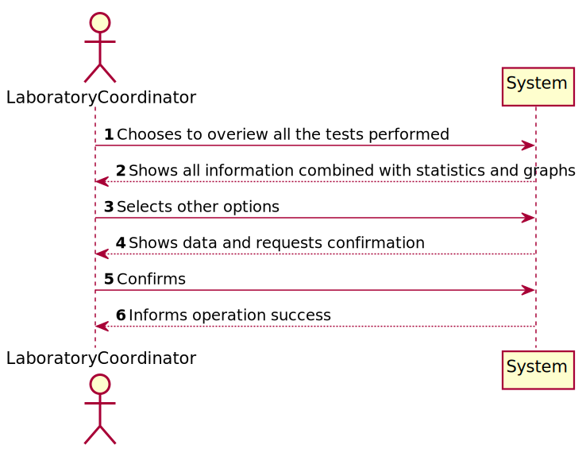
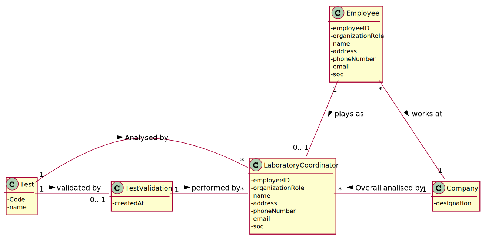
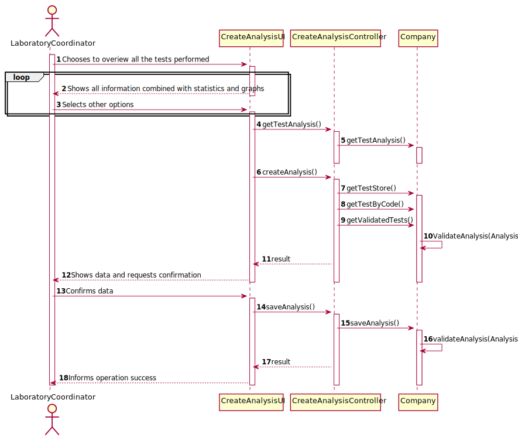
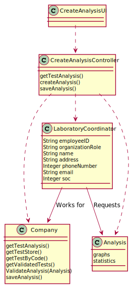

# US 16 - Overview all the tests performed by Many Labs and analyse the overall performance of the company
 
# 1. Requirements Engineering
                                                                         
## 1.1. User Story Description
 
 As a laboratory coordinator, I want to have an overview of all the tests performed by Many Labs and analyse the overall performance of the company.
 
## 1.2. Customer Specifications and Clarifications 
 
 **From the Specifications Document:**
 
 >   
 
 **From the client clarifications:**
 
 >   **Question:**  Should the interval of time considered for the evaluation be asked to the Laboratory Coordinator?
 >
 >   **Answer:** Yes. 
 
 -
 
 >   **Question:** When referring to "the application should also display statistics and graphs" is it up to the team to decide which API or resource should be used to generate graphs and statistics, or do you prefer something specific?
 >
 >   **Answer:** With JavaFX you can draw high quality graphs and there is no need to use other tools.   
 
 -
 
 >   **Question:** After the Laboratory Coordinator types the requested data and views the analysis of the company performance, should he be able to re-type different data and view the results for a different interval of time and/or algorithm? To make the re-type of the data easier, should there be a "clear" button, that is responsible for clearing the text fields for data entry?  
 >
 >   **Answer:** The laboratory coordinator should be able to explore different parameter values (settings) and check the results. Each team should prepare a simple and intuitive interface that requires a minimum number of interactions with the user.   
 
 -
 
 >   **Question:** Can we assume that every day in the interval defined by the coordinator is a working day with 12 working hours each?
 >
 >   **Answer:** Yes. 
 
 -
 
 >   **Question:** If Saturday or Sunday are in the interval should we skip them or count them also as working days?
 >
 >   **Answer:** Sunday is not a working day. All the other days of the week are working days.
 
 -
 
 >   **Question:** "For example one week (6 working days with 12 working hours)". In this case, is there any specifc hour to start filling the 144 integers list?
 >
 >   **Answer:** A working day is from 8h00 to 20h00.
 
 -
 
 >   **Question:** Does the laboratory coordinator also select the amount of working hours per day? Or should we just consider it as 12 working hours/day?
 >
 >   **Answer:** The lab coordinator does not select the amount of working hours per day. Please consider 12 working hours per day.
 
 -
 
 >   **Question:** The elements used in the algorithm refer to a half-hour interval?
 >
 >   **Answer:** Yes.
 
 -
 
 >   **Question:** How do we obtain the number to be used in the algorithm do we subtract tests that got a result in that interval and the tests registered?
 >
 >   **Answer:** Yes.
 
 -
 
 >   **Question:** Regarding US16, when the laboratory coordinator "analyses the overall performance of the company", is the analysis purely looking at the results? Or should he write any type of report based on the results for the interval he is seeing?
 >
 >   **Answer:** You should only identify the time interval where there was a delay in the response (the maximum subsequence).
 
 -
 
 >   **Question:** On the project description is written that "The algorithm to be used by the application must be defined through a configuration file", but on the requirements is written that "the laboratory coordinator should have the ability to dynamically select the algorithm to be applied from the ones available on the system". Should we discard the configuration file and add an option on the program to select one of the available algorithms?
 >
 >   **Answer:** Developing an application, like the one we are developing during the Integrative Project, is a dynamic process and the best teams are those who are prepared to react to change quickly. Moreover, the latest client requests/requirements are those that should be considered. Typically, a client updates the requirements throughout the project development.
 Please consider the requirements introduced at the beginning of Sprint D. The laboratory coordinator should have the ability to dynamically select the algorithm to be applied from the ones available on the system (either the benchmark algorithm provided in moodle or the brute-force algorithm to be developed by each team).  
 
-
 
>   **Question:** When you say tests waiting results are you referring to tests with samples collected but not analyzed yet? If so, and considering the csv file does not have an explicit date for when the sample is collected, which date should we use?
>
>   **Answer:** You should use the test registration date (Test_Reg_DateHour).
 
-
 
>   **Question:** What is the total number of tests processed in the laboratory? Is it the number of tests that were given results in that time span or is it the number of tests that were validated in that time span?
>
>   **Answer:** The total number of tests processed in the laboratory is the total number of tests that were validated by the laboratory coordinator.
In a previous answer I asked: "The laboratory coordinator should be able to check the number of clients, the number of tests waiting for results, the number of tests waiting for diagnosis and the total number of tests processed in the laboratory in each day, week, month and year. "
I asked these statistics for a given interval that should be selected by the user. Moreover, the application should also show to the laboratory coordinator the total number of clients and the total number of validated tests that exist in the system. 

-

>   **Question:** What are the statistics that require a graph, could you specify, please.
>
>   **Answer:** In a previous post I asked: "The laboratory coordinator should be able to check the number of clients, the number of tests waiting for results, the number of tests waiting for diagnosis and the total number of tests processed (tests validated) in the laboratory in each day, week, month and year. The system should show these statistics for a given interval that should be selected/defined by the user". 
The application should present these statistics using four graphs/charts, one for each time resolution (day, week, month and year). 
In a previous post I also said: "Moreover, the application should also show to the laboratory coordinator the total number of clients and the total number of validated tests that exist in the system.". There is no need to show these information using a graph/chart.

## 1.3. Acceptance Criteria
 
 * **AC1:** Laboratory coordinator should be able to select the algorithm to be applied. Support for easily adding other similar algorithms is required.
 * **AC2:** To facilitate overall analysis, the application should also display statistics and graphs.  
 
## 1.4. Found out Dependencies
 
 This US has a dependency to US15 (Laboratory Coordinator validates tests) and to US17 (Laboratory coordinator imports clinical tests from a CSV file).
 
## 1.5 Input and Output Data
 
 **Input Data:**
 
 **Output Data:** 
 
 * Company' tests performance 
 * Statistics and Graphs
 
## 1.6. System Sequence Diagram (SSD)
 
 
 
## 1.7 Other Relevant Remarks
 
 *Use this section to capture other relevant information that is related with this US such as (i) special requirements ; (ii) data and/or technology variations; (iii) how often this US is held.* 
 
# 2. OO Analysis
 
## 2.1. Relevant Domain Model Excerpt 
 
 
 
## 2.2. Other Remarks
 
 *Use this section to capture some aditional notes/remarks that must be taken into consideration into the design activity. In some case, it might be usefull to add other analysis artifacts (e.g. activity or state diagrams).* 
 
# 3. Design - User Story Realization 
 
## 3.1. Rationale
 
 **The rationale grounds on the SSD interactions and the identified input/output data.**
 

| Interaction ID | Question: Which class is responsible for... | Answer  | Justification (with patterns)  |
 |:-------------  |:--------------------- |:------------|:---------------------------- |
 | Step 1  		 | ... interacting with the actor? | CreateAnalysisUI | Pure Fabrications: there is no reason to assign this responsibility to any existing class in the Domain Model. |
 |   		 |	... coordinating the US?  |  CreateAbalysisController  | Controller |
 |   		 |	...instantiating a new analysis | LaboratoryCoordinator  | Creator: R1 |
 |            |  ... knowing the user using the system?  |  UserSession  |  IE: cf. A&A component documentation.  |
 | Step 2  		 |							 |             |                              |
 | Step 3  		 | ...saving the inputted data? | Analysis | IE: object created in step 1 has its own data. |
 | Step 4  		 |							 |             |                              |
 | Step 5  		 |... validating all data (local validation)? | Analysis | IE: owns its data.| 
 | 			  		 |	... validating all data (global validation)? | Company | IE: knows all its Analysis.| 
 | 			  		 |	... saving the created Analysis? | Company | IE: owns all its Analysis. | 
 | Step 6  		 | ... informing operation success? | CreateAnalysisUI  | IE: is responsible for user interactions.  | 
 
## Systematization ##

According to the taken rationale, the conceptual classes promoted to software classes are: 
 
  * Company
  * LaboratoryCoordinator
  * Analysis
 
Other software classes (i.e. Pure Fabrication) identified: 
 
  * CreateAnalysisUI  
  * CreateAnalysisController

## 3.2. Sequence Diagram (SD)

## 3.3. Class Diagram (CD)

# 4. Tests 
*In this section, it is suggested to systematize how the tests were designed to allow a correct measurement of requirements fulfilling.* 

**_DO NOT COPY ALL DEVELOPED TESTS HERE_**

**Test 1:** Check that it is not possible to create an instance of the Example class with null values. 

	@Test(expected = IllegalArgumentException.class)
		public void ensureNullIsNotAllowed() {
		Exemplo instance = new Exemplo(null, null);
	}

*It is also recommended to organize this content by subsections.* 

# 5. Construction (Implementation)

## Class CreateAnalysisUI

    package app.ui.console;

    import app.controller.CreateAnalysisController;
    import app.domain.model.Test;

    import java.text.ParseException;
    import java.text.SimpleDateFormat;
    import java.util.*;

    public class CreateAnalysisUI <option> implements Runnable {

    private CreateAnalysisController ctrl;
    String testToshow;
    String option;
    public String toString() {
        return "CreateAnalysisUI{" +
                "ctrl=" + ctrl +
                '}';
    }

    @Override
    public void run() {
        System.out.println("Overview all the tests");
        System.out.println(" ");
        getAllTests();
        MenuOptions();

        while (!option.equals("4")){
            switch (option) {
                case "1":
                    getInvalidTests();
                    MenuOptions();
                    break;

                case "2":
                    System.out.println("Tests done until now: \n");
                    System.out.print("Number of tests: ");
                    getNumberTests();
                    System.out.println(" ");
                    System.out.print("Number of registered tests: ");
                    getNumberRegistereddTests();
                    System.out.print("Number of validated tests: ");
                    getNumberValidatedTests();
                    System.out.print("Number of invalid tests: ");
                    getNumberInvalidTests();
                    MenuOptions();
                    break;

                case "3":
                    System.out.println(" ");
                    System.out.println("Enter first date: (dd/mm/yyyy)");
                    System.out.println("0 - Exit");
                    Scanner sc = new Scanner(System.in);
                    String sdatemenor = sc.nextLine();
                    if (sdatemenor.equals("0")) {
                        option = "4";
                    }
                    else {
                        System.out.println("Enter last date: (dd/mm/yyyy)");
                        System.out.println("0 - Exit");
                        String sdatemaior = sc.nextLine();
                        if (sdatemaior.equals("0")) {
                            option = "4";
                        }
                        else {
                            Date date1 = null;
                            Date date2 = null;
                            try {
                                date1 = new SimpleDateFormat("dd/MM/yyyy").parse(sdatemenor);
                                date2 = new SimpleDateFormat("dd/MM/yyyy").parse(sdatemaior);
                            } catch (ParseException e) {
                                e.printStackTrace();
                            }
                            if (date1.compareTo(date2) >  0) {
                                System.out.println("Date order was incorrect!");
                                System.out.println("Enter first date: (dd/mm/yyyy)");
                                System.out.println("0 - Exit");
                                Scanner sc2 = new Scanner(System.in);
                                sdatemenor = sc2.nextLine();
                                if (sdatemenor.equals("0")) {
                                    option = "4";
                                } else {
                                    System.out.println("Enter last date: (dd/mm/yyyy)");
                                    System.out.println("0 - Exit");
                                    sdatemaior = sc2.nextLine();
                                    if (sdatemaior.equals("0")) {
                                        option = "4";
                                    }
                                    else {
                                        date1 = null;
                                        date2 = null;
                                        try {
                                            date1 = new SimpleDateFormat("dd/MM/yyyy").parse(sdatemenor);
                                            date2 = new SimpleDateFormat("dd/MM/yyyy").parse(sdatemaior);
                                        }
                                        catch (ParseException e) {
                                            e.printStackTrace();
                                        }
                                    }
                                }
                            }

                            ArrayList<Test> testsBetweenDates = new ArrayList<>();
                            ArrayList<Test> registeredTestsBetweenDates = new ArrayList<>();
                            ArrayList<Test> validatedTestsBetweenDates = new ArrayList<>();
                            ArrayList<Test> invalidTestsBetweenDates = new ArrayList<>();
                            ArrayList<Test> tests = this.ctrl.getTestList();
                            for (Test test : tests) {
                                if (test.getDate().compareTo(date1) > 0 && test.getDate().compareTo(date2) < 0) {
                                    testsBetweenDates.add(test);
                                }
                            }

                            int v;
                            for (v = 0; v < testsBetweenDates.size(); v++) {
                                if (testsBetweenDates.get(v).state.equals("Valid")) {
                                    validatedTestsBetweenDates.add(testsBetweenDates.get(v));
                                }
                            }

                            int r;
                            for (r = 0; r < testsBetweenDates.size(); r++) {
                                if (testsBetweenDates.get(r).state.equals("Registered")) {
                                    registeredTestsBetweenDates.add(testsBetweenDates.get(r));
                                }
                            }

                            int i;
                            for (i = 0; i < testsBetweenDates.size(); i++) {
                                if (testsBetweenDates.get(i).state.equals("Invalid")) {
                                    invalidTestsBetweenDates.add(testsBetweenDates.get(i));
                                }
                            }

                            System.out.println("Tests between " + date1 + " and " + date2 + " :");
                            System.out.print("Number of tests: ");
                            System.out.println(testsBetweenDates.size());
                            System.out.print("Number of registered tests: ");
                            System.out.println(registeredTestsBetweenDates.size());
                            System.out.print("Number of validated tests: ");
                            System.out.println(validatedTestsBetweenDates.size());
                            System.out.print("Number of invalid tests: ");
                            System.out.println(invalidTestsBetweenDates.size());

                            MenuOptionsBetweenDates();
                            while (!testToshow.equals("5")) {
                                if (testToshow.equals("1")) {
                                    System.out.println(testsBetweenDates);
                                    MenuOptionsBetweenDates();
                                } else if (testToshow.equals("2")) {
                                    System.out.println(registeredTestsBetweenDates);
                                    MenuOptionsBetweenDates();
                                } else if (testToshow.equals("3")) {
                                    System.out.println(validatedTestsBetweenDates);
                                    MenuOptionsBetweenDates();
                                } else if (testToshow.equals("4")) {
                                    System.out.println(invalidTestsBetweenDates);
                                    MenuOptionsBetweenDates();

                                } else {

                                    MenuOptions();
                                    break;
                                }
                            }
                            MenuOptions();
                        }
                    }
                case "4":
                    break;

                case "5":
                    System.exit(0);
                    break;

                default:
                    System.out.println("Enter \"1\", \"2\", \"3\", \"4\" or \"5\"");
                    MenuOptions();
                    break;

            }
        }
    }

    public void MenuOptions () {
        System.out.println("List of options:");
        System.out.println(" ");
        System.out.println("1 - Show invalid tests");
        System.out.println("2 - Show the number of tests done until now");
        System.out.println("3 - Show tests between a specific period");
        System.out.println("4 - Go back to Laboratory Coordinator Menu");
        System.out.println("5 - Exit the program");
        Scanner chooseoption = new Scanner(System.in);
        option = chooseoption.nextLine();
    }

    public void MenuOptionsBetweenDates () {
        System.out.println("\n 1 - Show all Tests");
        System.out.println(" 2 - Show Registered Tests");
        System.out.println(" 3 - Show Validated Tests");
        System.out.println(" 4 - Show Invalid Tests");
        System.out.println(" 5 - Go Back");
        Scanner sc1 = new Scanner(System.in);
        testToshow = sc1.nextLine();
    }

    public void getAllTests () {
        ctrl = new CreateAnalysisController();
        ArrayList<Test> allTests = ctrl.getTestList();
        System.out.println(allTests);

    }

    public void getRegisteredTests () {
        ctrl = new CreateAnalysisController();
        ArrayList<Test> allTests = ctrl.getTestList();
        ArrayList<Test> registeredTests = new ArrayList<>();
        int i;
        for (i = 0; i < allTests.size(); i++) {
            if (allTests.get(i).state.equals("Registered")) {
                registeredTests.add(allTests.get(i));
            }
        }
        System.out.println(registeredTests);
    }

    public void getValidatedTests () {
        ctrl = new CreateAnalysisController();
        ArrayList<Test> allTests = ctrl.getTestList();
        ArrayList<Test> validatedTests = new ArrayList<>();
        int i;
        for (i = 0; i < allTests.size(); i++) {
            if (allTests.get(i).state.equals("Valid")) {
                validatedTests.add(allTests.get(i));
            }
        }
        System.out.println(validatedTests);
    }

    public void getInvalidTests () {
        ctrl = new CreateAnalysisController();
        ArrayList<Test> allTests = ctrl.getTestList();
        ArrayList<Test> invalidTests = new ArrayList<>();
        int i;
        for (i = 0; i < allTests.size(); i++) {
            if (allTests.get(i).state.equals("Invalid")) {
                invalidTests.add(allTests.get(i));
            }
        }
        System.out.println(invalidTests);
    }

    public void getNumberTests () {
        ctrl = new CreateAnalysisController();
        ArrayList<Test> allTests = ctrl.getTestList();
        System.out.println(allTests.size());
    }

    public void getNumberRegistereddTests () {
        ctrl = new CreateAnalysisController();
        ArrayList<Test> allTests = ctrl.getTestList();
        ArrayList<Test> registeredTests = new ArrayList<>();
        int i;
        for (i = 0; i < allTests.size(); i++) {
            if (allTests.get(i).state.equals("Registered")) {
                registeredTests.add(allTests.get(i));
            }
        }
        System.out.println(registeredTests.size());
    }

    public void getNumberValidatedTests () {
        ctrl = new CreateAnalysisController();
        ArrayList<Test> allTests = ctrl.getTestList();
        ArrayList<Test> validatedTests = new ArrayList<>();
        int i;
        for (i = 0; i < allTests.size(); i++) {
            if (allTests.get(i).state.equals("Valid")) {
                validatedTests.add(allTests.get(i));
            }
        }
        System.out.println(validatedTests.size());
    }

    public void getNumberInvalidTests () {
        ctrl = new CreateAnalysisController();
        ArrayList<Test> allTests = ctrl.getTestList();
        ArrayList<Test> invalidTests = new ArrayList<>();
        int i;
        for (i = 0; i < allTests.size(); i++) {
            if (allTests.get(i).state.equals("Invalid")) {
                invalidTests.add(allTests.get(i));
            }
        }
        System.out.println(invalidTests.size());
    }
    }

   
## Class CreateAnalysisController

    package app.controller;

    import app.domain.model.Test;
    import app.domain.model.Company;
    import app.domain.shared.Constants;
    import java.util.ArrayList;

    public class CreateAnalysisController {

    private final Company company;

    public CreateAnalysisController()
    {
        this(App.getInstance().getCompany());
    }
    public CreateAnalysisController(Company company)
    {
        checkUserAuth();
        this.company = company;
    }

    private void checkUserAuth() {
        boolean loggedInWithRole = App.getInstance().getCurrentUserSession().isLoggedInWithRole(Constants.ROLE_LABORATORYCOORDINATOR);
        if (!loggedInWithRole)
            throw new IllegalStateException("User has no permission to do this operation.");
    }

    public ArrayList<Test> getTestList() {
        return this.company.getTestList();
    }

    }

    }

# 6. Integration and Demo 

A new option on the Laboratory Coordinator Menu was added. 

# 7. Observations

*In this section, it is suggested to present a critical perspective on the developed work, pointing, for example, to other alternatives and or future related work.*

