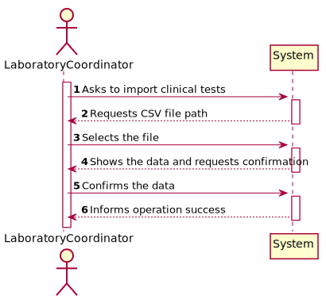
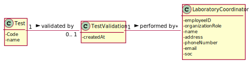
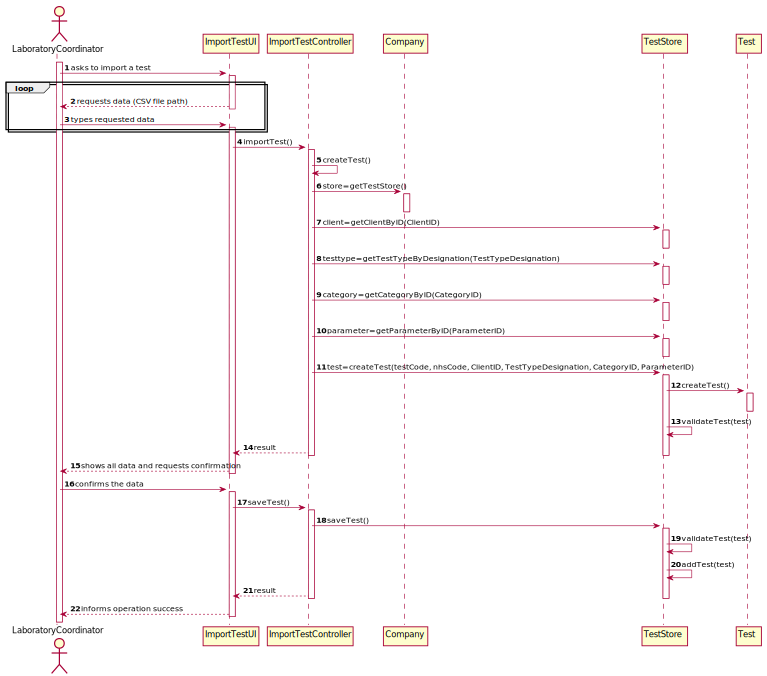
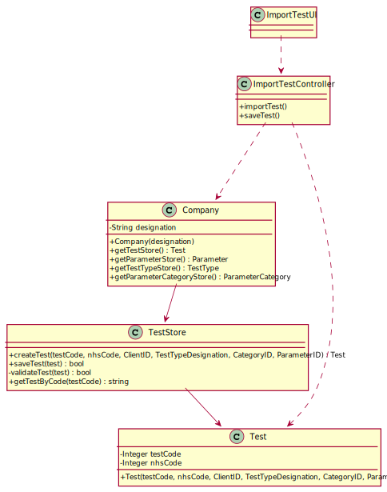

# US 017 - Import clinical tests

## 1. Requirements Engineering

### 1.1. User Story Description

As a laboratory coordinator, I want to import clinical tests from a CSV file.

### 1.2. Customer Specifications and Clarifications 

> **Question:** In what folder should the CSV file be when we want to use the application through the console?
>
> **Answer:** In this sprint each team should develop a graphical user interface. The file to import can be located in any folder. The user should specify the path of the file.

> -

> **Question:** In the CSV files provided for this sprint we can find a parameter with code HDL00 which belongs to the Cholesterol category and to the blood test type, but by searching the external modules for the blood test type the team could not find a match for the said parameter. What can we as a team do to resolve such issue?
>
> **Answer:** If the API does not have reference values for this parameter, than you should not present the reference values to the application user.

> -

> **Question:** Will the CSV files always have the same format as the ones available on moodle?
>
> **Answer:** Yes. But we can have more categories and parameters for each type of test.

>-

> **Question:** If a labID on the CSV file isn't found on the system, should we consider it "invalid data"?
>
> **Answer:** Yes. To import tests of any laboratory (with a given Lab_ID), it is required that a laboratory having the given Lab_ID exists in the system. Therefore, if you want to import data from a given laboratory, you should use the application to create that laboratory in the system. Then you should import the data. When creating a laboratory in the system, you should use the given Lab_ID (available in the CSV file) and define the other attributes using valid data. In this project, we are NOT going to import data from laboratories (or other entities) to reduce the amount of hours required to develop and deliver a working application to the client. What I say in this message is valid for the laboratories and for other entities that appear in the CSV files.

### 1.3. Acceptance Criteria

**AC1:** If the file contains invalid data (e.g., a parameter not
defined in the system), that data should not be load into the system. An exception
should be thrown.

### 1.4. Found out Dependencies

There is a dependency to US 16 (As a laboratory coordinator, I want to have an overview of all the tests performed
by Many Labs and analyse the overall performance of the company)

### 1.5 Input and Output Data

**Input Data:**
  
  * CSV file
 
**Output Data:**

 * Clinical Tests

### 1.6. System Sequence Diagram (SSD)

### 1.7 Other Relevant Remarks

No relevant remarks were found

## 2. OO Analysis

### 2.1. Relevant Domain Model Excerpt 

### 2.2. Other Remarks

No relevant remarks were found

## 3. Design - User Story Realization 

### 3.1. Rationale

**The rationale grounds on the SSD interactions and the identified input/output data.**

| Interaction ID | Question: Which class is responsible for... | Answer  | Justification (with patterns)  |
|:-------------  |:--------------------- |:------------|:---------------------------- |
| Step 1  		 | ... interacting with the actor? | ImportTestUI | Pure Fabrication: there is no reason to assign this responsibility to any existing class in the Domain Model. |
| | ...coordinating the US? | ImportTestController | Controller |
| | ...importing a new test? | LaboratoryCoordinator | Creator: R1 |
| Step 2  		 |							 |             |                              |
| Step 3  		 | ...saving the inputted data? | Test |  |
| Step 4  		 |							 |             |                              |
| Step 5  		 | ...validating all data (local validation)? | Test | IE: owns its data. |
| | ...validating all data (global validation)? | Company | IE: knows all its Tests. |
| | ...saving the Test | TestStore | IE: owns all its Tests. |
| Step 6  		 | ...informing operation success? | ImportTestUI | IE: is responsible for user interactions. |          

### Systematization ##

According to the taken rationale, the conceptual classes promoted to software classes are: 

 * Company
 * Test
 * TestStore
 * LaboratoryCoordinator

Other software classes (i.e. Pure Fabrication) identified: 

 * ImportTestUI  
 * ImportTestController

## 3.2. Sequence Diagram (SD)

## 3.3. Class Diagram (CD)

# 4. Tests 
*In this section, it is suggested to systematize how the tests were designed to allow a correct measurement of requirements fulfilling.* 

**_DO NOT COPY ALL DEVELOPED TESTS HERE_**

**Test 1:** Check that it is not possible to create an instance of the Example class with null values. 

	@Test(expected = IllegalArgumentException.class)
		public void ensureNullIsNotAllowed() {
		Exemplo instance = new Exemplo(null, null);
	}

*It is also recommended to organize this content by subsections.* 

# 5. Construction (Implementation)

*In this section, it is suggested to provide, if necessary, some evidence that the construction/implementation is in accordance with the previously carried out design. Furthermore, it is recommeded to mention/describe the existence of other relevant (e.g. configuration) files and highlight relevant commits.*

*It is also recommended to organize this content by subsections.* 

# 6. Integration and Demo 

*In this section, it is suggested to describe the efforts made to integrate this functionality with the other features of the system.*

# 7. Observations

*In this section, it is suggested to present a critical perspective on the developed work, pointing, for example, to other alternatives and or future related work.*

