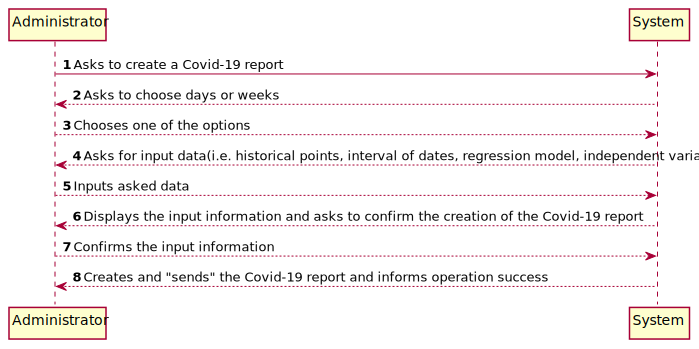
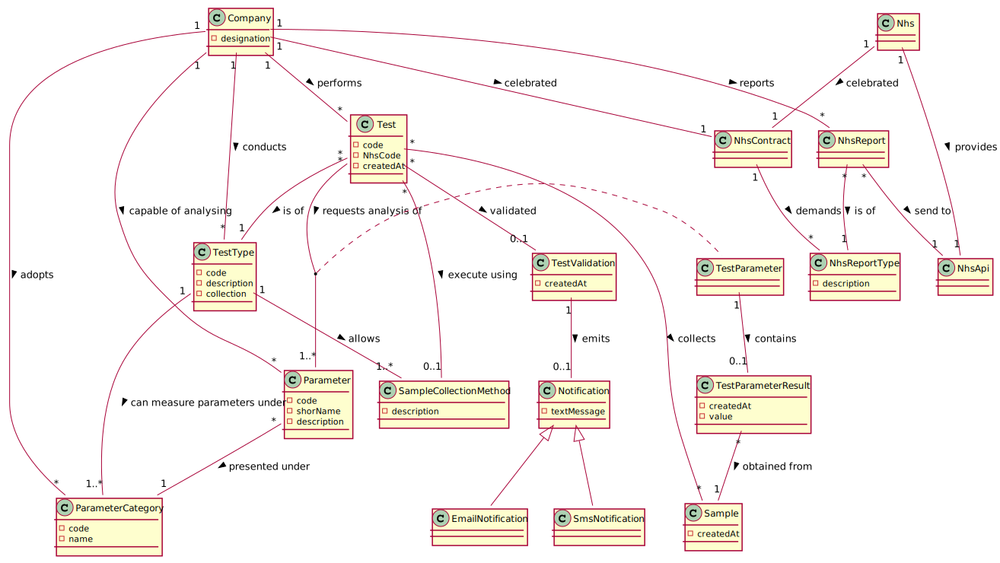
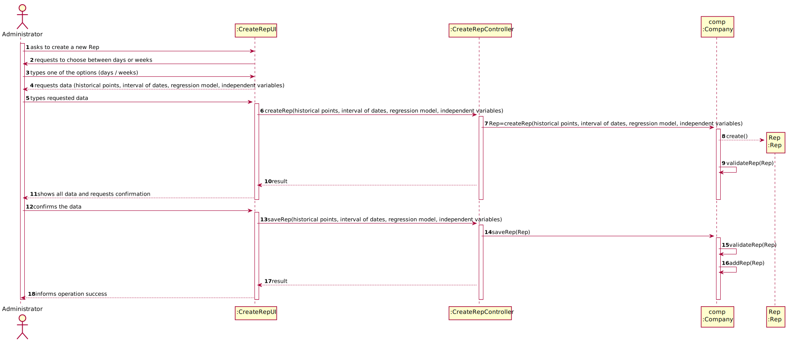
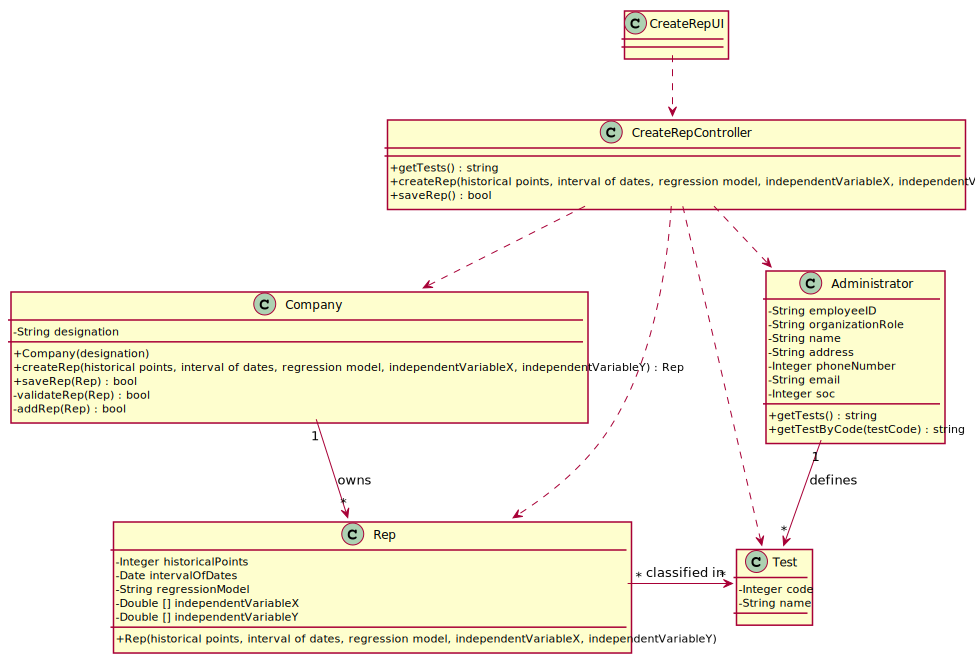

# US 018 - Send the Covid-19 report to the NHS at any time.

## 1. Requirements Engineering

### 1.1. User Story Description

As an Administrator I want to send the Covid-19 report to the NHS at any time. I want to define the interval of dates to fit the regression model, the number of historical points (number of days or number of weeks) that must be sent to the NHS, the regression model to use and select the independent variables to use. 

### 1.2. Customer Specifications and Clarifications 

**From the Specifications Document:**

>"send the forecasts for these same time horizons (the number of Covid-19 cases for the following day, next week and next month)."

**From the client clarifications:**

> **Question:** Sprint D requirements we get "I want to define... the number of historical points (number of days or number of weeks) that must be sent to the NHS". Is the Administrator who must choose between days or weeks? If so, how should he make this choice?
>
> **Answer:** Yes. The Administrator should select between days and weeks using the user interface.

-

> **Question:** From the project description it is known "send the forecasts for these same time horizons (the number of Covid-19 cases for the following day, next week and next month)." In the example report we have in moodle, there is a line that says "// Prediction values". Does this mean that after this line we should put our predictions or it refers to the following table?
>
> **Answer:** Yes, the prediction values are the ones available in the table that we include in the example.

### 1.3. Acceptance Criteria

* **AC1:**The system should allow the Administrator to select between a simple linear and multilinear regression model to fit the data. Moreover, the Administrator should be able to choose the independent variable touse with the simple linear regression model (either the number of tests realized or the mean age).The system should send the report using the NHS API (available in moodle). 

### 1.4. Found out Dependencies

*---

### 1.5 Input and Output Data

**Input Data:**

* Typed data:
	* Interval of dates
    * Selects between days or weeks
    * Number of historical points
    * Regression model to be used
    * Independent variables to be used
	
* Selected data:
	* ----------

**Output Data:**

* Covid-19 report for the NHS

### 1.6. System Sequence Diagram (SSD)

**Alternative 1**

### 1.7 Other Relevant Remarks

No Relevant Remarks were found. 

## 2. OO Analysis

### 2.1. Relevant Domain Model Excerpt 

### 2.2. Other Remarks

n/a

## 3. Design - User Story Realization 

### 3.1. Rationale

**SSD - Alternative 1 is adopted.**

| Interaction ID | Question: Which class is responsible for... | Answer  | Justification (with patterns)  |
|:-------------  |:--------------------- |:------------|:---------------------------- |
| Step 1  		 |	... interacting with the actor? | CreateRepUI   |  Pure Fabrication: there is no reason to assign this responsibility to any existing class in the Domain Model.           |
| 			  		 |	... coordinating the US? | CreateRepController | Controller                             |
| 			  		 |	... instantiating a new Report? | Administrator   | Creator: R1   |
| Step 2  		 |							 |             |                              |
| Step 3  		 |	...saving the inputted data? | System  | IE: object created in step 1 is saved by the System .  |
| Step 4  		 |	...knowing the test types to show? | Administrator  | IE: Reports are defined by the Administrator. |
| Step 5  		 |	... saving the selected report? | Administrator | IE: object created in step 1 is classified in one or more Type of Test.  |
| Step 6  		 |							 |             |                              |              
| Step 7  		 |	... validating all data (local validation)? | Rep | IE: owns its data.| 
| 			  		 |	... validating all data (global validation)? | Company | IE: knows all its reports.| 
| 			  		 |	... saving the created report? | Company | IE: owns all its reports.| 
| Step 8  		 |	... informing operation success?| CreateRepUI  | IE: is responsible for user interactions.  | 

### Systematization ##

According to the taken rationale, the conceptual classes promoted to software classes are: 

 * Company
 * Administrator
 * Rep

Other software classes (i.e. Pure Fabrication) identified: 

 * CreateRepUI  
 * CreateRepController

## 3.2. Sequence Diagram (SD)

**Alternative 1**

**Alternative 2**

## 3.3. Class Diagram (CD)

**From alternative 1**

# 4. Tests 

**Test 1:** Check AC1

# 5. Construction (Implementation)

## Class CreateRepController 

	package app.controller;

	import app.domain.model.*;

	import app.domain.shared.Constants;

	/**
	 *
	 */
	public class CreateRepController {

    private final Company company;

		public CreateRepController()
		{
			this(App.getInstance().getCompany());
		}

		/**
		 * checks userAuth and gives initializes the variables this.company and this.rep
		 * @param company Company
		 */
		public CreateRepController(Company company)
		{
			checkUserAuth();
			this.company = company;
		}

		/**
		 * Checks if user is logged in with the role of admin
		 */
		private void checkUserAuth() {
			boolean loggedInWithRole = App.getInstance().getCurrentUserSession().isLoggedInWithRole(Constants.ROLE_ADMIN);
			if (!loggedInWithRole)
				throw new IllegalStateException("User has no permission to do this operation.");
		}

		/**
		 * Creates the report
		 * @param rep  corresponds to the report
		 */
		public void createRep(String rep)
		{
			this.company.validateRep(rep);
		}

		/**
		 * "Sends" the report to NHS
		 * @param rep corresponds to the report
		 * @return returns report (rep)
		 */
		public boolean sendRep(String rep)
		{
			return this.company.sendRep(rep);
		}
	}

## Class Company

    public boolean validateRep(String rep) {
        Report2NHS(rep);
        return true;
    }

    private void Report2NHS(String data) {
        File file = new File("./NHSReport/NHSReport.txt");
        FileWriter fr = null;

        try {
            fr = new FileWriter(file);
            fr.write(data);
        } catch (IOException var12) {
            var12.printStackTrace();
        } finally {
            try {
                if (fr != null) {
                    fr.close();
                }
            } catch (IOException var11) {
                var11.printStackTrace();
            }

        }
    }

    public boolean sendRep(String rep) {
        return validateRep(rep);
    }

## Class Rep

	public class Rep {

		private int historicalPoints;
		private Date[] dateInterval;
		private String regressionModel;
		private int [] independantVariableX;
		private int [] independantVariableY;

		public Rep(int historicalPoints, Date[] dateInterval, String regressionModel, int[] independantVariableX, int[] independantVariableY) {
			this.historicalPoints = historicalPoints;
			this.dateInterval = dateInterval;
			this.regressionModel = regressionModel;
			this.independantVariableX = independantVariableX;
			this.independantVariableY = independantVariableY;
		}

		public int getHistoricalPoints() {
			return historicalPoints;
		}

		public void setHistoricalPoints(int historicalPoints) {
			this.historicalPoints = historicalPoints;
		}

		public Date[] getDateInterval() {
			return dateInterval;
		}

		public void setDateInterval(Date[] dateInterval) {
			this.dateInterval = dateInterval;
		}

		public String getRegressionModel() {
			return regressionModel;
		}

		public void setRegressionModel(String regressionModel) {
			this.regressionModel = regressionModel;
		}

		public int[] getIndependantVariableX() {
			return independantVariableX;
		}

		public void setIndependantVariableX(int[] independantVariableX) {
			this.independantVariableX = independantVariableX;
		}

		public int[] getIndependantVariableY() {
			return independantVariableY;
		}

		public void setIndependantVariableY(int[] independantVariableY) {
			this.independantVariableY = independantVariableY;
		}
	}
   

# 6. Integration and Demo 

* A new option on the Admin menu options was added.

# 7. Observations

