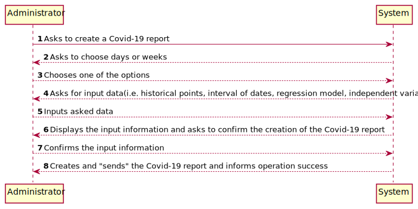
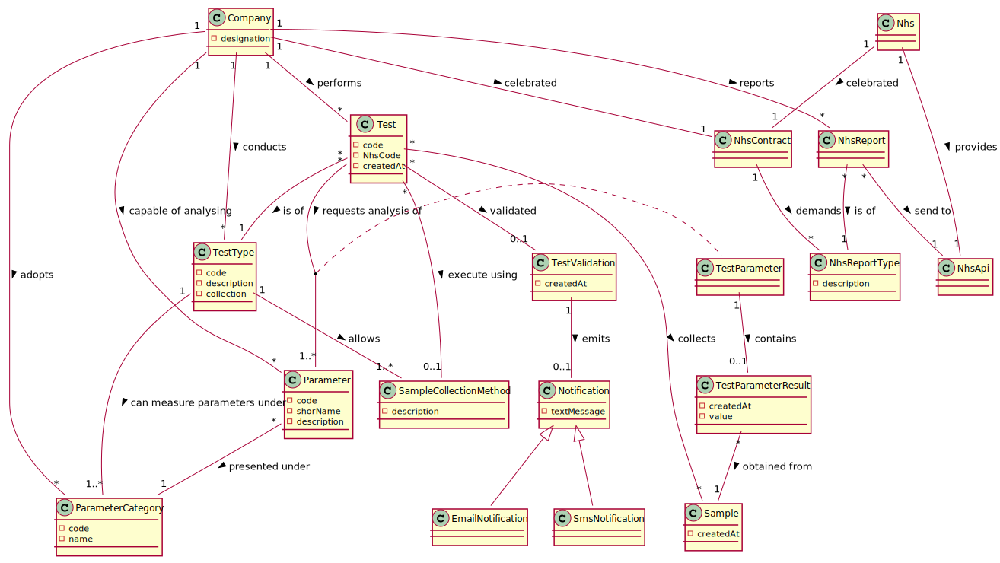
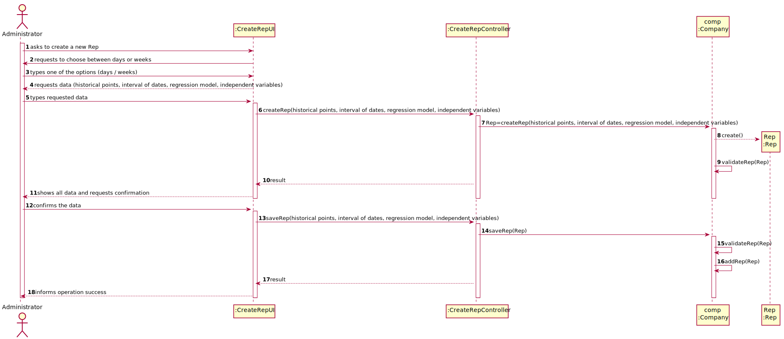
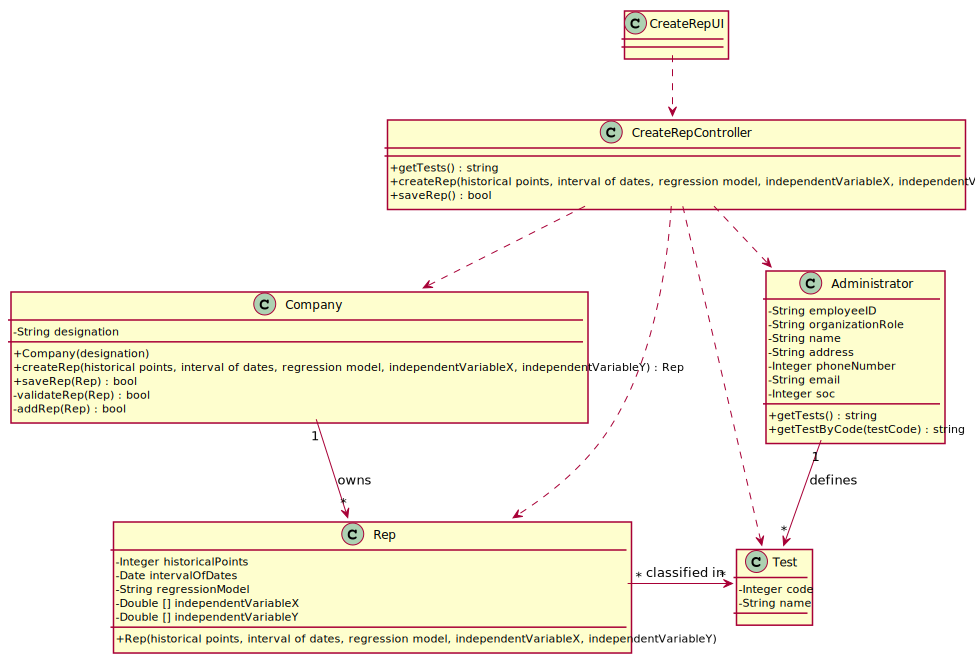

# US 019 - Send to the NHS daily reports of Covid-19 data, including the number of observed values and estimated values.

## 1. Requirements Engineering

### 1.1. User Story Description

The Many Labs company wants to send to the NHS daily reports of Covid-19 data, including the number of observed values and estimated values. Reports should be generated automatically with historical data and must be sent every day at 6:00 am.

### 1.2. Customer Specifications and Clarifications 

**From the Specifications Document:**

> "The report should include day and week (observed and estimated) values..." and also "Reports...must be sent every day at 6:00 am"

**From the client clarifications:**

> **Question:**As the report is generated automatically, should the system generate a notication that the report was sent?
>  
> **Answer:**The application should write the event into a log file.

-

> **Question:** in Sprint D Requirements, it says "The report should include day and week (observed and estimated) values..." and also "Reports...must be sent every day at 6:00 am". As the Report is to be automatically sent very early in the morning, do you wish the report to have the data concerning the day before and the last week starting at the day before?
>  
> **Answer:** The format of the report should follow the report example that is available in moodle.

-

> **Question:** Should the report contain the data of all the tests with results (with or without report, with or without validation) or contain only the validated tests? (Or other option?)
>   
> **Answer:**  The NHS Covid report should include statistics computed only from validated tests.

-

> **Question:**Are we going to be able to use more math libraries in order to facilitate the calculus (for example, for confidence intervals) or is the rest of the calculus to be developed by each team?
>  
> **Answer:** Each team should implement the classes and methods needed.

### 1.3. Acceptance Criteria

* **AC1:** The report should include day and week (observed and estimated) values, the regression model used to estimate each value, R(SLR), R2 
and R2 adjusted for SLR and MLR, hypothesis tests for regression coefficients significance model with Anova.
Simple linear and multilinear regression models can be used to compute the estimates and corresponding confidence intervals.
When the system is configured to use the simple linear regression model, the
performance of each model should be used to select the best model (the one that
uses the number of tests realized or the one that uses the mean age as independent
variable). The best model will be used to make the estimated/expected values that
will be send to NHS. The interval of dates to fit the regression model and the
number of historical points (number of days and number of weeks) must be
defined through a configuration file. The system should send the report using the
NHS API (available in moodle).

### 1.4. Found out Dependencies

*---

### 1.5 Input and Output Data

**Input Data:**

* Typed data:
    * ---------
	
* Selected data:
	* ----------

**Output Data:**

* Covid-19 report for the NHS

### 1.6. System Sequence Diagram (SSD)

**Alternative 1**

### 1.7 Other Relevant Remarks

No Relevant Remarks were found. 

## 2. OO Analysis

### 2.1. Relevant Domain Model Excerpt 

### 2.2. Other Remarks

n/a

## 3. Design - User Story Realization 

### 3.1. Rationale

**SSD - Alternative 1 is adopted.**

| Interaction ID | Question: Which class is responsible for... | Answer  | Justification (with patterns)  |
|:-------------  |:--------------------- |:------------|:---------------------------- |
| Step 1  		 |	... interacting with the actor? | CreateRepUI   |  Pure Fabrication: there is no reason to assign this responsibility to any existing class in the Domain Model.           |
| 			  		 |	... coordinating the US? | CreateRepController | Controller                             |
| 			  		 |	... instantiating a new Report? | Administrator   | Creator: R1   |
| Step 2  		 |							 |             |                              |
| Step 3  		 |	...saving the inputted data? | System  | IE: object created in step 1 is saved by the System .  |
| Step 4  		 |	...knowing the test types to show? | Administrator  | IE: Reports are defined by the Administrator. |
| Step 5  		 |	... saving the selected report? | Administrator | IE: object created in step 1 is classified in one or more Type of Test.  |
| Step 6  		 |							 |             |                              |              
| Step 7  		 |	... validating all data (local validation)? | Rep | IE: owns its data.| 
| 			  		 |	... validating all data (global validation)? | Company | IE: knows all its reports.| 
| 			  		 |	... "send" the created report? | Company | IE: owns all its reports.| 
| Step 8  		 |	... informing operation success?| CreateRepUI  | IE: is responsible for user interactions.  | 

### Systematization ##

According to the taken rationale, the conceptual classes promoted to software classes are: 

 * Company
 * Administrator
 * Rep

Other software classes (i.e. Pure Fabrication) identified: 

 * CreateRepUI  
 * CreateRepController

## 3.2. Sequence Diagram (SD)

**Alternative 1**

## 3.3. Class Diagram (CD)

**From alternative 1**

# 4. Tests 

**Test 1:** Check AC1

# 5. Construction (Implementation)

## Class CreateRepController 

	package app.controller;

	import app.domain.model.*;

	import app.domain.shared.Constants;

	/**
	 *
	 */
	public class CreateRepController {

    private final Company company;

		public CreateRepController()
		{
			this(App.getInstance().getCompany());
		}

		/**
		 * checks userAuth and gives initializes the variables this.company and this.rep
		 * @param company Company
		 */
		public CreateRepController(Company company)
		{
			checkUserAuth();
			this.company = company;
		}

		/**
		 * Checks if user is logged in with the role of admin
		 */
		private void checkUserAuth() {
			boolean loggedInWithRole = App.getInstance().getCurrentUserSession().isLoggedInWithRole(Constants.ROLE_ADMIN);
			if (!loggedInWithRole)
				throw new IllegalStateException("User has no permission to do this operation.");
		}

		/**
		 * Creates the report
		 * @param rep  corresponds to the report
		 */
		public void createRep(String rep)
		{
			this.company.validateRep(rep);
		}

		/**
		 * "Sends" the report to NHS
		 * @param rep corresponds to the report
		 * @return returns report (rep)
		 */
		public boolean sendRep(String rep)
		{
			return this.company.sendRep(rep);
		}
	}

## Class Company

    public boolean validateRep(String rep) {
        Report2NHS(rep);
        return true;
    }

    private void Report2NHS(String data) {
        File file = new File("./NHSReport/NHSReport.txt");
        FileWriter fr = null;

        try {
            fr = new FileWriter(file);
            fr.write(data);
        } catch (IOException var12) {
            var12.printStackTrace();
        } finally {
            try {
                if (fr != null) {
                    fr.close();
                }
            } catch (IOException var11) {
                var11.printStackTrace();
            }

        }
    }

    public boolean sendRep(String rep) {
        return validateRep(rep);
    }

## Class Rep

	public class Rep {

		private int historicalPoints;
		private Date[] dateInterval;
		private String regressionModel;
		private int [] independantVariableX;
		private int [] independantVariableY;

		public Rep(int historicalPoints, Date[] dateInterval, String regressionModel, int[] independantVariableX, int[] independantVariableY) {
			this.historicalPoints = historicalPoints;
			this.dateInterval = dateInterval;
			this.regressionModel = regressionModel;
			this.independantVariableX = independantVariableX;
			this.independantVariableY = independantVariableY;
		}

		public int getHistoricalPoints() {
			return historicalPoints;
		}

		public void setHistoricalPoints(int historicalPoints) {
			this.historicalPoints = historicalPoints;
		}

		public Date[] getDateInterval() {
			return dateInterval;
		}

		public void setDateInterval(Date[] dateInterval) {
			this.dateInterval = dateInterval;
		}

		public String getRegressionModel() {
			return regressionModel;
		}

		public void setRegressionModel(String regressionModel) {
			this.regressionModel = regressionModel;
		}

		public int[] getIndependantVariableX() {
			return independantVariableX;
		}

		public void setIndependantVariableX(int[] independantVariableX) {
			this.independantVariableX = independantVariableX;
		}

		public int[] getIndependantVariableY() {
			return independantVariableY;
		}

		public void setIndependantVariableY(int[] independantVariableY) {
			this.independantVariableY = independantVariableY;
		}
	}
   
# 6. Integration and Demo 

* A new option on the Admin menu options was added.

# 7. Observations

