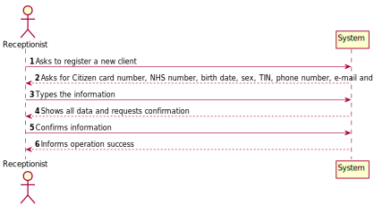
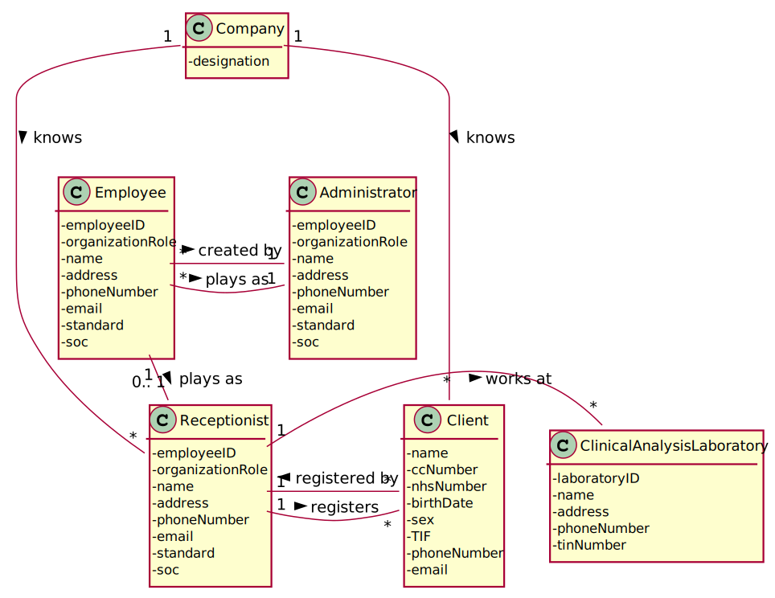
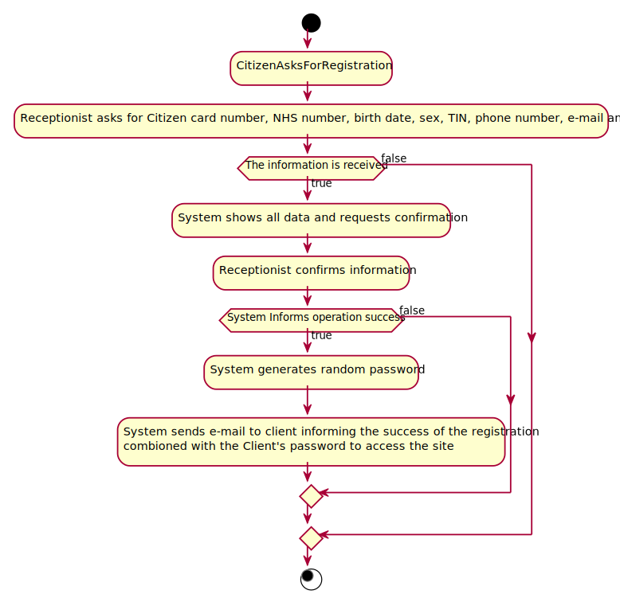
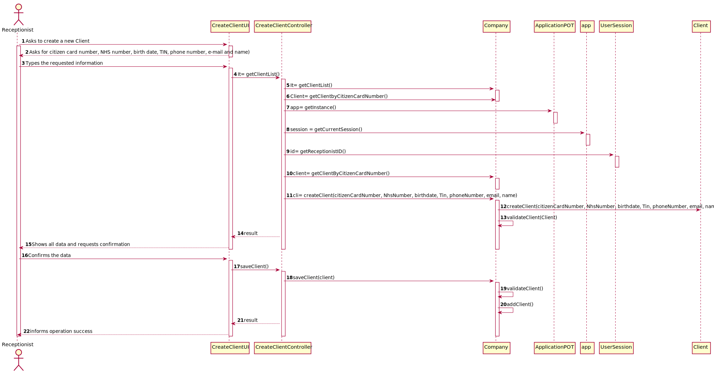
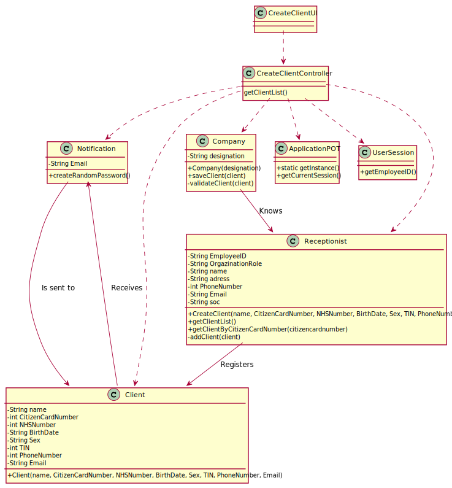

# US 003 - Register a client

## 1. Requirements Engineering

### 1.1. User Story Description

As a receptionist of the laboratory, I want to register a client.

### 1.2. Customer Specifications and Clarifications 

**From the Specifications Document:**

>   "To register a client, the receptionist needs the client’s citizen card number, National Healthcare Service (NHS) number, birth date, sex, Tax Identification number (TIF), phone number, e-mail and name."

**From the client clarifications:**

>   **Question:** After being registered by the receptionist, should the client receive some kind of confirmation e-mail in order to finish his registration?
>
>   **Answer:** The client only receives an e-mail informing that the registration was successful and that he can start to use the system. The e-mail includes the client password.

-

>   **Question:** During the registration of a customer, if he gives a phone number already used by another customer, should the registration continue normally or should it be canceled?
>
>   **Answer:** The e-mail address and phone number should be unique for each user. The system should present a message informing about the error and asking for a different phone number.

-

>   **Question:** how are the passwords delivered to the users (client/employee)?
>
>   **Answer:** Each users receives an e-mail informing that the registration was successful and that he can start to use the system. The e-mail includes the user password.

### 1.3. Acceptance Criteria

* **AC1:** The client must become a system user. 
* **AC2:** The "auth" component available on the repository must be reused.
* **AC3:** The Citizen Card Number must be a 16 digit number.
* **AC4:** The NHS number has to be a 10 digit number.
* **AC5:** The birth date must come in the format DD/MM/YY.
* **AC6:** The client's sex is optional but with only two options: Male/Female.
* **AC7:** The TIN must be a 10 digit number.
* **AC8:** The phone number must be a 11 digit number.

### 1.4. Found out Dependencies

There is a dependency between US3 and US4(registering a test to a client) because the client has to be registered in the system to register his exam.

### 1.5 Input and Output Data

**Input Data:**

* Citizen card number
* National Healthcare Service (NHS) number
* Birth date
* Sex
* Tax Identification number (TIN)
* Phone number
* E-mail
* Name.

**Output Data:**

### 1.6. System Sequence Diagram (SSD)

### 1.7 Other Relevant Remarks

After the registration is done successfully the client has to receive an e-mail informing he is registered combined with his password that should be randomly generated.

## 2. OO Analysis

### 2.1. Relevant Domain Model Excerpt 

### 2.2. Other Remarks

## 3. Design - User Story Realization 

### 3.1. Rationale

**The rationale grounds on the SSD interactions and the identified input/output data.**

| Interaction ID | Question: Which class is responsible for... | Answer  | Justification (with patterns)  |
|:-------------  |:--------------------- |:------------|:---------------------------- |
| Step 1  		 |	... interacting with the actor? | CreateClientUI   |  Pure Fabrication: there is no reason to assign this responsibility to any existing class in the Domain Model.           |
| 			  		 |	... coordinating the US? | CreateClientController | Controller                             |
| 			  		 |	... instantiating a new Client? | Receptionist   | Creator: R1   |
| 			  		 | ... knowing the user using the system?  | UserSession  | IE: cf. A&A component documentation.  |
| Step 2  		 |							 |             |                              |
| Step 3  		 |	...saving the inputted data? | Client  | IE: object created in step 1 has its own data.  |
| Step 4|							 |             |                              |              
| Step 5  		 |	... validating all data (local validation)? | Client | IE: owns its data.| 
| 			  		 |	... validating all data (global validation)? | Company | IE: knows all its Clients.| 
| 			  		 |	... saving the created Client? | Company | IE: owns all its Clients.| 
| Step 6  		 |	... informing operation success?| CreateClientUI  | IE: is responsible for user interactions.  | 

### Systematization ##

According to the taken rationale, the conceptual classes promoted to software classes are: 

 * Company
 * Receptionist
 * Client

Other software classes (i.e. Pure Fabrication) identified:

 * CreateClientUI  
 * CreateClientController

## 3.2. Sequence Diagram (SD)

## 3.3. Class Diagram (CD)

# 4. Tests 
*In this section, it is suggested to systematize how the tests were designed to allow a correct measurement of requirements fulfilling.* 

**_DO NOT COPY ALL DEVELOPED TESTS HERE_**

**Test 1:** Check that it is not possible to create an instance of the Example class with null values. 

	@Test(expected = IllegalArgumentException.class)
		public void ensureNullIsNotAllowed() {
		Exemplo instance = new Exemplo(null, null);
	}

*It is also recommended to organize this content by subsections.* 

# 5. Construction (Implementation)

## Class CreateClientController

package app.controller;

import app.domain.model.Client;
import app.domain.model.Receptionist;
import app.domain.shared.Constants;
import app.domain.model.Company;
import com.sun.corba.se.impl.interceptors.PIHandlerImpl;

public class CreateClientController
{
    private Receptionist receptionist;
    private Client client;
    private Company company;

    public CreateClientController(Company company)
    {
        checkUserAuth();
        this.company = company;
        this.client = null;
    }
    public CreateClientController(Receptionist receptionist)
    {
        checkUserAuth();
        this.receptionist = receptionist;
        this.client = null;
    }

    public CreateClientController() {

    }

    private void checkUserAuth() {
        boolean loggedInWithRole = App.getInstance().getCurrentUserSession().isLoggedInWithRole(Constants.ROLE_ADMIN);
        if (!loggedInWithRole)
            throw new IllegalStateException("User has no permission to do this operation.");
    }

    public boolean createClient (String Name, int CitizenCardNumber, int NHSNumber, String BirthDate, String Sex, int TIN, int PhoneNumber, String Email)
    {
        return this.receptionist.createClient(Name, CitizenCardNumber, NHSNumber, BirthDate, Sex, TIN, PhoneNumber, Email);
    }

    public boolean saveClient()
    {
        return this.company.saveClient(client);
    }
}

## Class Client 

package app.domain.model;

import java.util.function.ToIntBiFunction;

public class Client {

    private String Name;
    private int CitizenCardNumber;
    private int NHSNumber;
    private String BirthDate;
    private String Sex;
    private int TIN;
    private int PhoneNumber;
    private String Email;

    public Client (String Name, int CitizenCardNumber, int NHSNumber, String BirthDate, String Sex, int TIN, int PhoneNumber, String Email){
        this.Name = Name;
        this.CitizenCardNumber = CitizenCardNumber;
        this.NHSNumber = NHSNumber;
        this.BirthDate = BirthDate;
        this.Sex = Sex;
        this.TIN = TIN;
        this.PhoneNumber = PhoneNumber;
        this.Email = Email;
        
   ## Class Receptionist

package app.domain.model;
import app.controller.App;

import java.util.List;

public class Receptionist {
    private String EmployeeID;
    private String OrganizationRole;
    private String name;
    private String adress;
    private int PhoneNumber;
    private String Email;
    private String soc;
    private Company company;

    public Receptionist(String EmployeeID, String OrganizationRole, String name, String adress, int PhoneNumber, String Email, String soc) {
        this.EmployeeID = EmployeeID;
        this.OrganizationRole = OrganizationRole;
        this.name = name;
        this.adress = adress;
        this.PhoneNumber = PhoneNumber;
        this.Email = Email;
        this.soc = soc;
        this.company = App.getInstance().getCompany();
    }

    public boolean createClient(String Name, int CitizenCardNumber, int NHSNumber, String BirthDate, String Sex, int TIN, int PhoneNumber, String Email) { {
            return company.saveClient (new Client(Name, CitizenCardNumber, NHSNumber, BirthDate, Sex, TIN, PhoneNumber, Email));
        }
    }
    public List<Client> getClientList (Company company){
        return company.getClientList;
    }

    public void addClient(Client client){
        getClientList(company).add(client);
    }

}

## Class Notification 

package app.domain.model;
import java.util.UUID;

public class Notification {
    private String Email;
    private static final String TEXT = "Your registration has been successful. \n" +
            "Use this password: " + generatePassword();

    public Notification (String Email){
        this.Email = Email;
    }
    public String getEmail() {
        return Email;
    }

    public static String generatePassword() {
        String password = UUID.randomUUID().toString();
        return password;
    }

}

## Class  CreateClient Controller

package app.ui.console;

import app.controller.CreateClientController;
import app.ui.console.utils.Utils;

import javax.rmi.CORBA.Util;

public class CreateClientUI implements Runnable{

    private CreateClientController ctrl;

    public CreateClientUI(){
        this.ctrl = new CreateClientController();
    }

    public void run() {

        System.out.println("\n Creating a new clinical analysis laboratory: \n");
        try {
            if (readData())
            {
                if (Utils.confirm("Do you confirm the new clinical analysis laboratory (Y/N)")) {
                    if (this.ctrl.saveClient()) {
                        System.out.println("Record save with success.");
                    } else {
                        System.out.println("An error occurred while attempting to save the record.");
                    }
                }
            }
            else
            {
                System.out.println("Provided information already exists.");
            }
        }catch(Exception ex)
        {
            System.out.println("Ocorreu um erro: operação cancelada. \n" + ex.getMessage());
        }
    }

    private boolean readData() {
        String Name = Utils.readLineFromConsole("Name:");
        int CitizenCardNumber = Utils.readIntegerFromConsole("CitizenCardNumber: ");
        int NHSNumber = Utils.readIntegerFromConsole("NHSNumber: ");
        String BirthDate = Utils.readLineFromConsole("BirthDate: ");
        String Sex = Utils.readLineFromConsole("Sex: ");
        int TIN = Utils.readIntegerFromConsole("TIN: ");
        int PhoneNumber = Utils.readIntegerFromConsole("PhoneNumber: ");
        String Email = Utils.readLineFromConsole("Email: ");

        return this.ctrl.createClient(Name, CitizenCardNumber, NHSNumber, BirthDate, Sex, TIN, PhoneNumber, Email);
    }
}

# 6. Integration and Demo 

A new option was created on the Admin Menu.

# 7. Observations

*In this section, it is suggested to present a critical perspective on the developed work, pointing, for example, to other alternatives and or future related work.*

