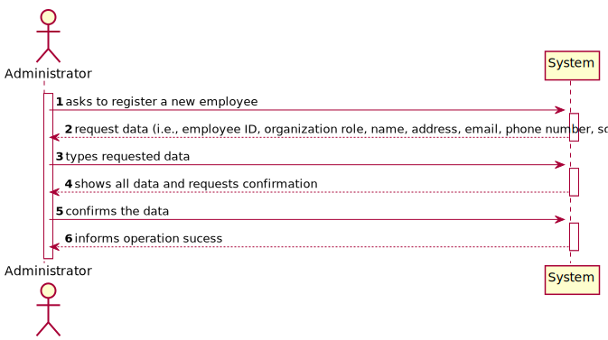
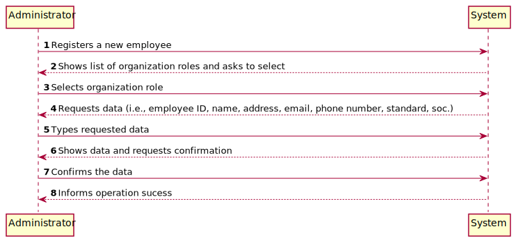
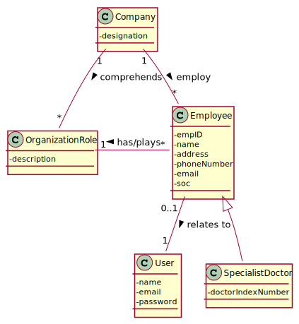
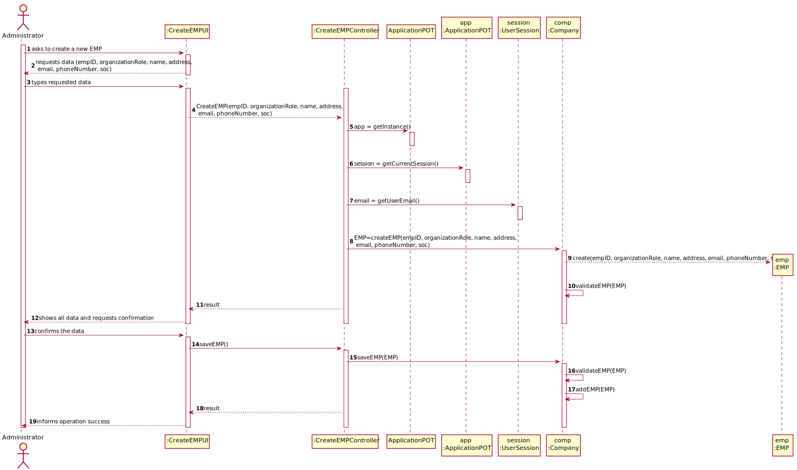
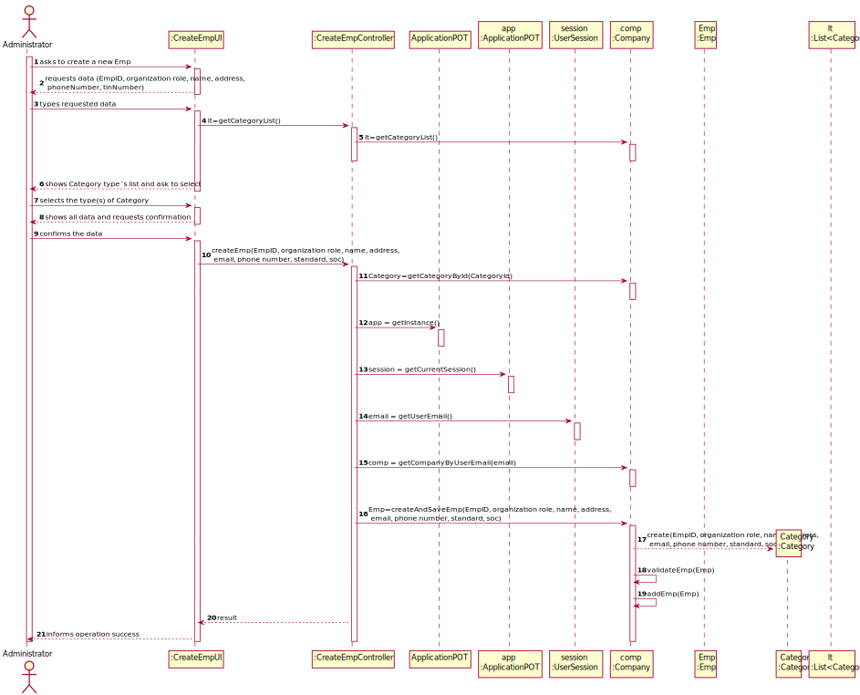
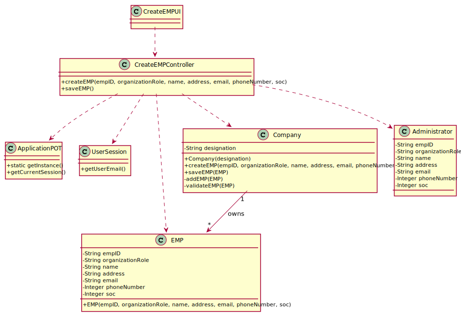

# US 007 - Register a new employee

## 1. Requirements Engineering

### 1.1. User Story Description

As an administrator, I want to register a new employee.

### 1.2. Customer Specifications and Clarifications 

**From the specifications document:**

>	(none)

**From the client clarifications:**

> **Question:** What information does the administrator need to register a new employee?
>  
> **Answer:** The administrator is required to fill up 8 fields to register a new employee and those are: 

* an employee ID, 
* an organization role, 
* a name,
* an address,
* an email,  
* a phone number,
* a soc.

* The Specialist Doctor has an additional attribute:
	Doctor Index Number.

-

> **Question:**How should we generate the employee ID and what type and length should it have ?
>  
> **Answer:** The employee ID should be generated from the initials of the employee's name and should include a number. The number should have 5 digits and it increases automatically when a new employee is registered in the system.

### 1.3. Acceptance Criteria

* **AC1:** : Each user must have a single role defined in the system. The "auth" component available on the repository must be reused (without modifications).
* **AC2:** : The employeeID must have employee�s initials and five alphanumeric characters.
* **AC3:** : The organizationRole must have less than 15 characters.
* **AC4:** : The name must have less than 35 characters.
* **AC5:** : The address must have less than 30 characters.
* **AC6:** : The phoneNumber must be a 11 digit number.

### 1.4. Found out Dependencies

No dependencies were found.

### 1.5 Input and Output Data

**Input Data:**

* Typed data:
	* an employee ID,  
	* a name,  
	* an organization role,
	* an address,  
	* an email,  
	* a phone number,
    * a soc.
	
	* The Specialist Doctor has an additional attribute:
		Doctor Index Number.

* Selected data:
	* none.

**Output Data:**

* (In)Success of the operation

### 1.6. System Sequence Diagram (SSD)

**Alternative 1**

<!--**Alternative 2**

 --->

**Other alternatives might exist.**

### 1.7 Other Relevant Remarks

* No relevant marks were found.

## 2. OO Analysis

### 2.1. Relevant Domain Model Excerpt 

### 2.2. Other Remarks

n/a

## 3. Design - User Story Realization 

### 3.1. Rationale

**SSD - Alternative 1 is adopted.**

| Interaction ID | Question: Which class is responsible for... | Answer  | Justification (with patterns)  |
|:-------------  |:--------------------- |:------------|:---------------------------- |
| Step 1  		 |	... interacting with the actor? | CreateEmpUI   |  Pure Fabrication: there is no reason to assign this responsibility to any existing class in the Domain Model.           |
| 			  		 |	... coordinating the US? | CreateEmpController | Controller                             |
| 			  		 |	... instantiating a new Employee? | Administrator   | Creator (Rule 1): in the DM Organization has a Employee.   |
| 			  		 | ... knowing the user using the system?  | UserSession  | IE: cf. A&A component documentation.  |
| 			  		 |	... knowing to which organization the user belongs to? | Platform  | IE: has registed all Company |
| Step 2  		 |							 |             |                              |
| Step 3  		 |	...saving the inputted data? | Employee  | IE: object created in step 1 has its own data.  |
| Step 4  		 |							 |             |                              |              
| Step 5  		 |	... validating all data (local validation)? | Employee | IE: owns its data.| 
| 			  		 |	... validating all data (global validation)? | Company | IE: knows all its employees.| 
| 			  		 |	... saving the created employee? | Company | IE: owns all its tasks.| 
| Step 6  		 |	... informing operation success?| CreateEmpUI  | IE: is responsible for user interactions.  | 

### Systematization ##

According to the taken rationale, the conceptual classes promoted to software classes are: 

 * Company
 * Administrator
 * Employee
 

Other software classes (i.e. Pure Fabrication) identified: 

 * CreateEmpUI  
 * CreateEmpController

## 3.2. Sequence Diagram (SD)

**Alternative 1**

<!--**Alternative 2**

-->

## 3.3. Class Diagram (CD)

**From alternative 1**

# 4. Tests 

**Test 1:** Check that it is not possible to create an instance of the Employee class with null values. 

	@Test(expected = IllegalArgumentException.class)
		public void ensureNullIsNotAllowed() {
		Emp instance = new Emp(null, null, null, null, null, null, null);
	}
	
**Test 2:** Check that it is not possible to create an instance of the Employee class with an emplyeeID not containing initials and 5 chars - AC2. 

    @Test(expected = IllegalArgumentException.class)
    public void ensureReferenceMeetsAC2() {
        EMP instance = new EMP("AB123456", "Rececionista", "Alberto", "eastern road 36", "123@gmail.com", "12345678901", "1234");
    }
	
**Test 3:** Check that it is not possible to create an instance of the Employee class with an organizationRole containing more than 15 chars - AC3. 

    @Test(expected = IllegalArgumentException.class)
    public void ensureReferenceMeetsAC3() {
        EMP instance = new EMP("AB12345", "Rececionistasdcs", "Alberto", "eastern road 36", "123@gmail.com", "12345678901", "1234");
    }
	
**Test 4:** Check that it is not possible to create an instance of the Employee class with a name containing more than 35 chars - AC4. 

    @Test(expected = IllegalArgumentException.class)
    public void ensureReferenceMeetsAC4() {
        EMP instance = new EMP("AB12345", "Rececionista", "Albertosdederfetgsdeftdferdesasdaesd", "eastern road 36", "123@gmail.com", "12345678901", "1234");
    }
	
**Test 5:** Check that it is not possible to create an instance of the Employee class with an address containing more than 30 chars - AC5. 

    @Test(expected = IllegalArgumentException.class)
    public void ensureReferenceMeetsAC5() {
        EMP instance = new EMP("AB12345", "Rececionista", "Alberto", "eastern road 36 dfertgfdsdfertg", "123@gmail.com", "12345678901", "1234");
    }
	
**Test 6:** Check that it is not possible to create an instance of the Employee class with a phoneNumner not containing  11 chars - AC6. 

    @Test(expected = IllegalArgumentException.class)
    public void ensureReferenceMeetsAC6() {
        EMP instance = new EMP("AB12345", "Rececionista", "Alberto", "eastern road 36", "123@gmail.com", "1234567890", "1234");
    }
	

# 5. Construction (Implementation)

## Class CreateEMPController 

		private Company company;
		private EMP emp;

		public boolean createEMP(String empID, String organizationRole, String name, String address, String email, String phoneNumber, String soc)
		{
			this.emp = this.company.createEMP(empID, organizationRole, name, address, email, phoneNumber, soc);
			return this.company.validateEMP(emp);
		}

		public boolean saveEMP()
		{
			return this.company.saveEMP(emp);
		}

## Class Company

		private String designation;
		private AuthFacade authFacade;

		private List<EMP> EMPList;

		public Company(String designation)
		{
			if (StringUtils.isBlank(designation))
				throw new IllegalArgumentException("Designation cannot be blank.");

			this.designation = designation;
			this.authFacade = new AuthFacade();

			this.EMPList = new ArrayList<>();
		}
		
		public EMP createEMP(String empID, String organizationRole, String name, String address,  String email, String phoneNumber, String soc)
		{
			return new EMP(empID, organizationRole, name, address, email, phoneNumber, soc);
		}

		public boolean saveEMP(EMP emp) {
			if (!validateEMP(emp))
				return false;
			return this.EMPList.add(emp);
		}

		public boolean validateEMP(EMP emp) {
			if (emp == null)
				return false;
			return ! this.EMPList.contains(emp);
		}

		public boolean addEMP(EMP emp)
		{
			return this.EMPList.add(emp);
		}

## Class EMP

		private String empID;
		private String organizationRole;
		private String name;
		private String address;
		private String email;
		private String phoneNumber;
		private String soc;

		public EMP(String empID, String organizationRole, String name, String address, String email, String phoneNumber, String soc)
		{
			checkempID(empID);
			checkorganizationRole(organizationRole);
			checkname(name);
			checkaddress(address);
			checkphoneNumber(phoneNumber);

			this.empID = empID;
			this.organizationRole = organizationRole;
			this.name = name;
			this.address = address;
			this.email = email;
			this.phoneNumber = phoneNumber;
			this.soc = soc;
		}

# 6. Integration and Demo 

* A new option on the Admin menu options was added.

# 7. Observations

Company class is getting too many responsibilities due to IE pattern and, therefore, it is becoming huge and harder to maintain. 

Is there any way to avoid this to happen?

